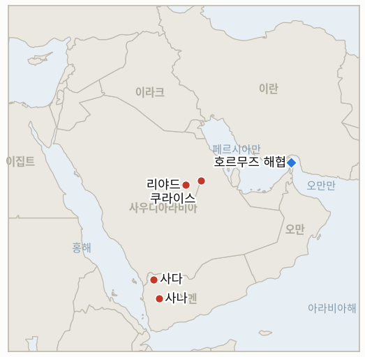

# 중동 일일 브리핑

**2026년 10월 5일**

- **보고 기간:** 약 24시간, 10월 4일 09:00 ~ 10월 5일 06:00 (한국시간)
- **종합 평가:** 일요일 사우디와 후티의 전쟁이 확대됐다. 후티는 리야드 인근과 쿠라이스 유전의 아람코 시설을 미사일과 드론으로 타격했다고 주장했고, 예멘 정부는 연합군의 지원 아래 후티 장악 지역을 탈환하는 작전을 선언했다(§1.1, §1.2). 워싱턴은 세 번째 항모를 보내고 있으나 이란은 호르무즈 재개방에 대한 미국의 답변에 아직 회신하지 않았고, 해협 인근에서는 선박 피격이 이어진다(§1.3). 시장은 휴장해 월요일 장이 열릴 때까지 금요일 수치가 유지된다(§1.4).

---

## 1. 무슨 일이 있었나

<figure style="float:right; width:46%; margin:2pt 0 8pt 14pt;">

<figcaption style="font-size:8pt; color:#666; text-align:center; margin-top:3pt; font-style:italic;">주요 논의 지점</figcaption>
</figure>

### 1.1 후티가 리야드 인근과 쿠라이스의 아람코 시설 타격을 주장한다

후티 대변인 야히야 사리는 미사일과 드론으로 리야드 시내 시설과 수도 동쪽 쿠라이스 유전이 피해를 입었다고 밝혔고, 온라인에 퍼진 영상에는 곳곳의 화재와 검은 연기가 담겼다([The Washington Times](https://www.washingtontimes.com/news/2026/oct/4/houthis-claim-responsibility-attack-saudi-oil-facility-yemen-war/)). 사우디 당국과 아람코는 리야드 남쪽 시설 화재의 원인을 확인하지 않았고, 연합군은 후티의 주장이 "오도하는 것"이라고 일축했다([The National](https://www.thenationalnews.com/news/gulf/2026/10/04/yemen-government-forces-strike-sanaa-and-saada-as-houthis-claim-aramco-attack/)). 후티군은 사우디가 지난 24시간 동안 공습과 미사일 공격 106회를 가했다고 밝혔다([ABC News Australia](https://www.abc.net.au/news/2026-10-04/houthi-saudi-yemen-iraq-middle-east-hostilities/107226524)). **신뢰도: 화재와 연기 보도는 높음, 피해 규모와 쿠라이스 주장은 낮음(미확인), 106회는 낮음(후티 측 발표).**

### 1.2 예멘 정부가 후티 장악 지역 탈환 작전을 선언한다

예멘 대통령지도위원회 의장 라샤드 알알리미는 후티 장악 지역을 되찾는 군사 작전의 개시를 발표했고, 정부군은 사나와 사다의 "핵심 표적"을 타격했다([The National](https://www.thenationalnews.com/news/gulf/2026/10/04/yemen-government-forces-strike-sanaa-and-saada-as-houthis-claim-aramco-attack/)). 당국자들은 후티 전투원 약 700명을 사살했다고 주장했으나 검증되지 않았고, 타이즈와 라헤즈에서 정밀 작전 97건을 수행했다고 밝혔다. CNN은 사우디 주도 연합군이 이 공세를 지지하기로 했다고 보도했다([CNN](https://www.cnn.com/2026/10/04/middleeast/yemen-offensive-houthis-intl), 헤드라인만 확인, 본문 접근 불가). 보고 기간 중 홍해 연안에서의 지상 진격은 보도되지 않았다. **신뢰도: 선언과 공습은 높음, 사상자 수치는 낮음(당사자 발표).**

### 1.3 세 번째 미 항모가 지역으로 향하고 호르무즈에 대한 이란의 회신은 지연된다

JD 밴스 부통령이 주재한 캠프데이비드 회의에 마르코 루비오 국무장관, 피트 헤그세스 국방장관, 존 랫클리프 CIA 국장이 참석해 이란과 사우디·후티 충돌 확대를 논의했으나 공식 발표는 없었다. 항공모함 시어도어 루스벨트 전단과 상륙함 마킨 아일랜드가 지역으로 향하고 있어, 10월 말까지 걸프에 항모 세 척과 2만 명 이상의 미군 병력이 배치될 수 있다([HNGN](https://www.hngn.com/articles/273430/20261004/camp-david-war-council-three-carriers-put-iran-midterm-clock.htm)). 테헤란은 해협 재개방을 위한 7일 계획에 대한 워싱턴의 공식 답변을 받았지만 회신하지 않았다. 쟁점은 순서로, 미국은 해협 개방을 먼저 요구하고 이란은 재개방 이후 제재 완화와 핵 협상을 요구한다. 9월 28일 이후 해협과 그 인근에서 최소 7척이 피격됐고 가장 최근 사례는 일요일이며, 책임을 주장한 곳은 없다([HNGN](https://www.hngn.com/articles/273430/20261004/camp-david-war-council-three-carriers-put-iran-midterm-clock.htm)). **신뢰도: 중간(단일 종합 출처, 피격 선박 수와 병력 총계는 미검증).**

### 1.4 시장은 휴장해 금요일 수치가 유지된다

일요일에는 브렌트유와 WTI 정산이 없었고 한국거래소도 휴장해, 마지막으로 확인된 수치는 브렌트유 102.25달러, WTI 91.11달러, 코스피 7,003.74, 원·달러 환율 1,350.6원이다(10월 3일 브리핑 참조). 아람코 관련 주장에 대한 첫 시장 반응은 월요일 장에서 확인된다. **신뢰도: 거래가 없었다는 점은 높음.**

---

## 2. 심층 분석: 유인과 동기

### 2.1 후티는 왜 리야드에 더해 쿠라이스까지 거명하는가?

두 번째 표적을 거명하면 위협이 한 곳에서 사우디 석유 체계의 동서 전체로 넓어지고, 피해가 작더라도 비용이 들지 않기 때문이다. 리야드가 피해를 확인하지 않으면 시장은 계속 추측하게 되는데, 이는 양측 모두에 유리하다. 후티는 위험 프리미엄을 얻고 리야드는 취약성을 드러내지 않는다.

### 2.2 예멘 정부는 왜 지금 작전을 선언하는가?

지난주 공세 계획 보도 이후, 선언이 사우디의 공습 작전에 예멘 정부라는 정치적 얼굴과 명시적 목표를 부여하기 때문이다. 또한 리야드가 자국의 공습을 사우디의 전쟁이 아니라 정부 지원으로 규정할 수 있게 한다. 시험대는 지상군이 움직이는지 여부이며, 선언은 진격보다 값싸다.

### 2.3 이란은 왜 호르무즈에 대한 회신을 미루는가?

미국의 답변이 여전히 해협 개방을 먼저 요구하는 한 지연이 테헤란에 주는 비용이 작고, 가시적인 미군 증강은 순서 문제에서 양보하는 대가를 키우기 때문이다. 선박 공격에 책임을 주장하지 않는 것도 이란의 협상력을 유지해 준다. 위험은 중간선거 일주일 전인 10월 말 항모 도착으로 지연할 여지가 줄어든다는 점이다.

---

## 3. 한국에 대한 정책적 시사점

**노출도 요약:** 한국은 원유의 약 70.7%, LNG의 약 20.4%를 중동에서 들여온다([KITA](https://www.kita.net/board/totalTradeNews/totalNewsExistDetail.do?no=99558); `instructions/korea-exposure.md`, 갱신 불필요). 이번 보고 기간에는 시장 거래가 없어 금요일의 브렌트유 102.25달러와 원·달러 1,350.6원이 최신 수치다.

**전개별 시사점:**

- **아람코 주장(§1.1):** 사우디는 한국의 핵심 원유 공급국이므로 리야드나 쿠라이스 인근 피해가 확인되면 가격뿐 아니라 공급에 직접 타격이 된다. 월요일 브렌트유와 코스피 개장이 첫 판단 지표다.
- **예멘 작전(§1.2):** 홍해 연안을 향한 지상전은 한국 수입업체가 호르무즈 대안으로 쓰는 얀부 선적과 홍해 항로의 위험을 높인다.
- **항모 증강과 교착된 호르무즈 외교(§1.3):** 미군 증강과 이란의 무응답은 한국의 호르무즈 파견 문제(IND-20260928-2)에 대한 압박을 유지시킨다. 보고 기간에 한국 정부의 새 입장은 없었다.
- **시장(§1.4):** 한국 시장은 월요일 재개하며 아람코 관련 주장이 주된 새 변수다.

**검증 가능한 지표:**

- **IND-20261005-1** (진행 중, 신규): 사우디, 아람코 또는 독립 영상을 갖춘 실명 매체가 쿠라이스 유전의 피해를 확인하거나, 어느 거래일이든 브렌트유가 105달러를 넘어 정산되는 일이 ~2026-10-12까지 발생한다. 명시적 부인이 있거나 확인이 없고 브렌트유가 105달러 아래면 기각된다.
- **IND-20261004-1** (진행 중): 리야드 인근 화재에 대한 아람코의 확인. 이번 기간에도 미확인, 기한 ~2026-10-11.
- **IND-20261004-2** (진행 중): 루스벨트 전단의 중부사령부 작전구역 진입 보도. 이동 중으로 보도됨, 기한 ~2026-10-25.
- **IND-20261003-1** (진행 중): 홍해 연안 지상 공세. 예멘 정부가 작전을 선언했으나 연안 지상 진격은 보도되지 않아 유지, 기한 ~2026-10-23.
- **IND-20261003-2** (진행 중): 브렌트유가 95달러 아래로 정산된 적 없음. 이번 기간에는 거래 없음, 기한 ~2026-10-16.
- **IND-20261002-1**, **IND-20261002-2**, **IND-20261001-1**, **IND-20261001-2**, **IND-20260927-3**, **IND-20260930-1**, **IND-20260929-1**, **IND-20260930-2**, **IND-20260928-1**, **IND-20260928-2**, **IND-20260928-3**, **IND-20260714-4** (진행 중): 판정할 새 정보 없음. 다만 미국 답변에 대한 이란의 회신(IND-20260930-1, IND-20261001-1)은 여전히 없고, 선박이 또 피격돼 책임 주체 미확인이라는 IND-20261002-2의 양상이 이어졌다.

---

## 4. 관찰 목록

- **리야드와 쿠라이스 피해의 확인 또는 부인 (IND-20261004-1, IND-20261005-1).**
- **예멘 지상군의 홍해 연안 진격 여부 (IND-20261003-1).**
- **호르무즈 순서 문제에 대한 이란의 회신 (IND-20261001-1).**
- **루스벨트 전단의 도착 (IND-20261004-2).**
- **월요일 브렌트유와 코스피 개장 (IND-20261003-2, IND-20261001-2).**

---

## 5. 출처 품질 요약

| 주장 | 출처 | 신뢰도 |
|---|---|---|
| 후티의 리야드·쿠라이스 인근 타격 주장, 연기 보도 | The Washington Times, The National | 화재는 중간, 피해는 낮음(사우디 미확인) |
| 24시간 사우디 공격 106회 | ABC News Australia(후티 발표) | 낮음 |
| 예멘 정부 작전 선언, 사나·사다 타격 | The National, CNN(헤드라인만) | 선언은 높음, 700명 사살은 낮음 |
| 캠프데이비드 회의, 세 번째 항모와 상륙함 파견 | HNGN | 중간 |
| 이란 미회신, 9월 28일 이후 선박 7척 피격 | HNGN | 중간 |
| 시장 거래 없음, 금요일 수치 유지 | 10월 3일 브리핑, KRX 일정 | 높음 |
