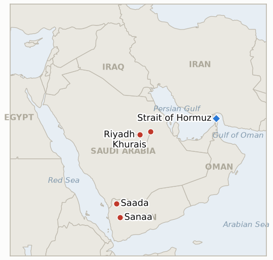
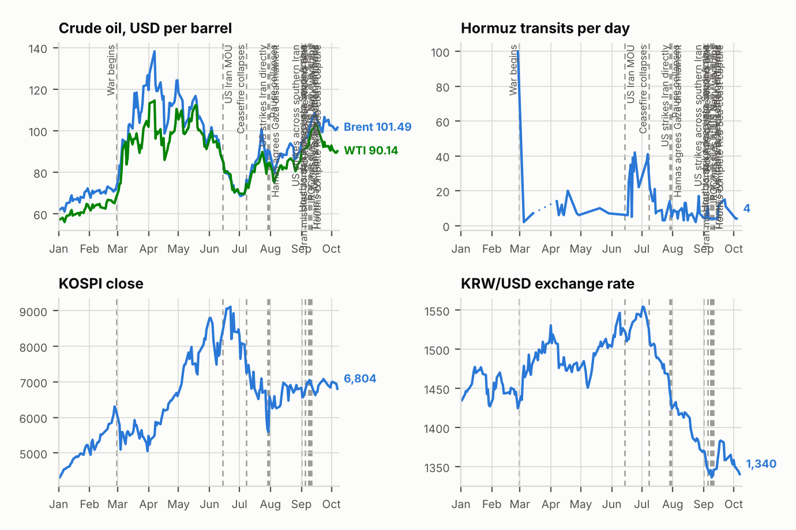

# Middle East Daily Briefing

**October 5, 2026**

- **Reporting window:** ~24 hours, October 4, 09:00 to October 5, 06:00 KST
- **Overall assessment:** The Saudi and Houthi war widened on Sunday: the Houthis claimed missile and drone strikes on Aramco sites near Riyadh and at the Khurais field, and Yemen's government declared operations to retake Houthi territory with coalition support (§1.1, §1.2). Washington is adding a third carrier while Iran still has not answered the US reply on reopening Hormuz, and ships keep being hit near the strait (§1.3). Markets were closed, so Friday's levels stand until Monday's session (§1.4).

---

## 1. What Happened

<figure style="float:right; width:46%; margin:2pt 0 8pt 14pt;">

<figcaption style="font-size:8pt; color:#666; text-align:center; margin-top:3pt; font-style:italic;">Major places of discussion</figcaption>
</figure>

### 1.1 The Houthis claim strikes on Aramco sites near Riyadh and at Khurais

Houthi spokesman Yahya Saree said missiles and drones damaged sites in Riyadh and the Khurais oil field east of the capital, and images circulating online showed scattered fires and black smoke ([The Washington Times](https://www.washingtontimes.com/news/2026/oct/4/houthis-claim-responsibility-attack-saudi-oil-facility-yemen-war/)). Saudi authorities and Aramco did not confirm the cause of a fire at a site south of Riyadh, and the coalition called the Houthi claims "misleading" ([The National](https://www.thenationalnews.com/news/gulf/2026/10/04/yemen-government-forces-strike-sanaa-and-saada-as-houthis-claim-aramco-attack/)). Houthi forces said Saudi Arabia carried out 106 air and missile strikes in the previous 24 hours ([ABC News Australia](https://www.abc.net.au/news/2026-10-04/houthi-saudi-yemen-iraq-middle-east-hostilities/107226524)). **Confidence: High that a fire and smoke were reported; Low on damage and on the Khurais claim, which is unconfirmed; Low on the 106 figure (Houthi source).**

### 1.2 Yemen's government declares operations to retake Houthi territory

Rashad al-Alimi, head of Yemen's Presidential Leadership Council, announced the start of military operations to reclaim Houthi held territory, and government forces struck "vital targets" in Sanaa and Saada ([The National](https://www.thenationalnews.com/news/gulf/2026/10/04/yemen-government-forces-strike-sanaa-and-saada-as-houthis-claim-aramco-attack/)). Officials claimed about 700 Houthi fighters killed, which is unverified, and reported 97 precision operations in Taiz and Lahij; CNN reported the Saudi led coalition pledged support for the offensive ([CNN](https://www.cnn.com/2026/10/04/middleeast/yemen-offensive-houthis-intl), headline only; page not retrievable). No ground advance on the Red Sea coast was reported in the window. **Confidence: High that the declaration and strikes occurred; Low on casualty figures (partisan source).**

### 1.3 A third US carrier heads to the region as Iran's reply on Hormuz is still awaited

Vice President Vance chaired a Camp David meeting with Rubio, Hegseth and CIA Director Ratcliffe on Iran and the Saudi and Houthi escalation; no readout was released. The USS Theodore Roosevelt group and the amphibious ship USS Makin Island are heading to the region, which could put three carriers and more than 20,000 US personnel in the Gulf by late October ([HNGN](https://www.hngn.com/articles/273430/20261004/camp-david-war-council-three-carriers-put-iran-midterm-clock.htm)). Tehran has Washington's formal reply to its seven day plan to reopen the strait but has not answered; the dispute is over sequencing, with the US wanting access first and Iran wanting sanctions relief and nuclear talks to follow reopening. At least seven vessels have been struck in and around the strait since September 28, the latest on Sunday, with no claim of responsibility ([HNGN](https://www.hngn.com/articles/273430/20261004/camp-david-war-council-three-carriers-put-iran-midterm-clock.htm)). **Confidence: Medium (single aggregated source; the vessel count and personnel total are unverified).**

### 1.4 Markets are closed, so Friday's levels stand

Sunday had no Brent or WTI settlement and KRX was closed, so the last confirmed figures remain Brent $102.25, WTI $91.11, KOSPI 7,003.74 and the won at 1,350.6 per dollar (see the October 3 brief). Monday's session is the first market test of the Aramco claims. **Confidence: High that no session occurred.**

---

## 2. Deep Dive: Incentives and Motives

### 2.1 Why would the Houthis name Khurais as well as Riyadh?

Because a second named target widens the threat from one site to Saudi Arabia's east to west oil system, and naming it costs nothing even if damage is minor. Riyadh's reluctance to confirm damage keeps markets guessing, which suits both sides: the Houthis gain a risk premium, Riyadh avoids signalling vulnerability.

### 2.2 Why is Yemen's government announcing operations now?

Because the declaration gives the Saudi air campaign a Yemeni political face and a stated goal, after reports last week of a planned offensive. It also lets Riyadh frame its strikes as support for a government rather than a Saudi war. Whether ground forces move is the test; announcements are cheaper than advances.

### 2.3 Why is Iran holding its answer on Hormuz?

Because delay costs Tehran little while the US reply still demands the strait open first, and a visible US buildup raises the price of conceding on sequencing. Iran also keeps leverage by leaving ship attacks unclaimed. The risk for Tehran is that the late October carrier arrival, a week before the midterms, shrinks the room for delay.

---

## 3. Policy Implications for South Korea

**Exposure snapshot:** South Korea draws about 70.7% of its crude and 20.4% of its LNG from the Middle East ([KITA](https://www.kita.net/board/totalTradeNews/totalNewsExistDetail.do?no=99558); `instructions/korea-exposure.md`, no update needed). There was no market session in the window, so Friday's Brent $102.25 and won 1,350.6 are the latest figures.

**Implications by development:**

- **Aramco claims (§1.1):** Saudi Arabia is a core Korean crude supplier, so confirmed damage near Riyadh or Khurais would hit Korea's supply directly rather than only through price; Monday's Brent and KOSPI open are the first read.
- **Yemen operations (§1.2):** a ground campaign toward the Red Sea coast raises risk to Yanbu loadings and Red Sea routing that Korean importers use as the Hormuz alternative.
- **Carrier buildup and stalled Hormuz diplomacy (§1.3):** more US force and no Iranian answer keep pressure on Seoul's Hormuz deployment question (IND-20260928-2); no new Korean government statement appeared in the window.
- **Markets (§1.4):** Korea reopens Monday with the Aramco claims as the main new input.

**Testable indicators:**

- **IND-20261005-1** (open, new): Saudi Arabia, Aramco, or a named outlet with independent imagery confirms damage at the Khurais oil field, or Brent settles above $105 on any session by ~2026-10-12; an explicit denial or no confirmation and Brent below $105 by that date falsifies it.
- **IND-20261004-1** (open): Aramco confirmation of the Riyadh area fire; still unconfirmed in this window, deadline ~2026-10-11.
- **IND-20261004-2** (open): Theodore Roosevelt group reported in the CENTCOM area; reported heading there, deadline ~2026-10-25.
- **IND-20261003-1** (open): the Red Sea coast ground offensive; Yemen's government declared operations but no coastal ground advance was reported, so it stays open, deadline ~2026-10-23.
- **IND-20261003-2** (open): Brent has not settled below $95; no session in this window, deadline ~2026-10-16.
- **IND-20261002-1**, **IND-20261002-2**, **IND-20261001-1**, **IND-20261001-2**, **IND-20260927-3**, **IND-20260930-1**, **IND-20260929-1**, **IND-20260930-2**, **IND-20260928-1**, **IND-20260928-2**, **IND-20260928-3**, **IND-20260714-4** (open): no new resolving information, except that Iran's reply to the US response (IND-20260930-1, IND-20261001-1) remains outstanding and another ship was struck, adding to the IND-20261002-2 pattern with no attribution.

---

## 4. Watch List

- **Confirmation or denial of damage at Riyadh and Khurais (IND-20261004-1, IND-20261005-1).**
- **Whether Yemeni ground forces advance on the Red Sea coast (IND-20261003-1).**
- **Iran's answer to the US reply on Hormuz sequencing (IND-20261001-1).**
- **Theodore Roosevelt group arrival (IND-20261004-2).**
- **Monday's Brent and KOSPI open (IND-20261003-2, IND-20261001-2).**

---

## 5. Source Quality Summary

| Claim | Sources | Confidence |
| --- | --- | --- |
| Houthi claim of strikes near Riyadh and Khurais; smoke reported | The Washington Times, The National | Medium on fire; Low on damage, unconfirmed by Saudi Arabia |
| 106 Saudi strikes in 24 hours | ABC News Australia (Houthi statement) | Low |
| Yemen government declares operations; strikes on Sanaa and Saada | The National, CNN (headline only) | High on declaration; Low on 700 killed |
| Camp David meeting; third carrier and amphibious group heading to region | HNGN | Medium |
| Iran has not answered US reply; seven vessels struck since Sept 28 | HNGN | Medium |
| No market sessions; Friday levels stand | October 3 brief, KRX calendar | High |
