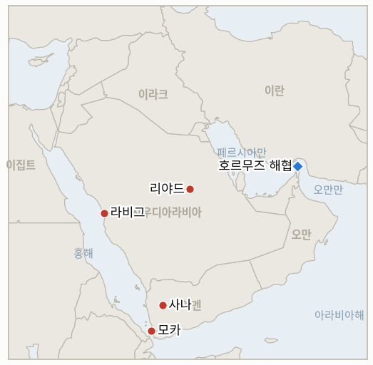

# 중동 일일 브리핑

**2026년 10월 6일**

- **보고 기간:** 약 24시간, 10월 5일 06:00 ~ 10월 6일 06:00 (한국시간)
- **종합 평가:** 사우디가 후원하는 예멘 정부가 선언했던 공세를 지상·해상 작전으로 확대해 모카와 바브엘만데브 인근 진지를 장악했다고 주장했고, 후티는 리야드 공항과 라비그 정유시설을 타격했다고 주장했지만 리야드는 이를 확인하지 않았다(§1.1, §1.2). 호르무즈 인근에서 세 번째 유조선이 피격됐고 이란 대통령은 미국과의 협상을 거부했다(§1.3). 그럼에도 브렌트유는 아람코의 대폭적인 아시아 가격 인하와 걸프 수출 회복이 예멘 위험을 상쇄해 1.9% 내린 100.32달러에 마감했다(§1.4).

**정정 및 업데이트:** 10월 5일 브리핑(§1.4, §3)은 한국 시장이 "월요일에 재개한다"고 썼다. 그러나 10월 5일은 10월 3일(토)에 겹친 개천절의 대체공휴일이어서 한국거래소가 휴장했다. 따라서 금요일 코스피 7,003.74와 원·달러 1,350.6 이후 첫 한국 거래일은 10월 6일(화)이며, 월요일 브렌트유 하락에 대응하는 코스피·환율 수치는 없다.

---

## 1. 무슨 일이 있었나

<figure style="float:right; width:46%; margin:2pt 0 8pt 14pt;">

<figcaption style="font-size:8pt; color:#666; text-align:center; margin-top:3pt; font-style:italic;">주요 논의 지점</figcaption>
</figure>

### 1.1 예멘 정부가 대규모 공세를 밀어붙이며 모카 탈환을 주장한다

사우디가 후원하는 예멘 정부군은 후티 장악 지역 전체를 되찾는 작전을 시작했다. 예멘군은 후티 진지에 대한 공습이 1,000건을 넘는다고 주장했고, 월요일 호데이다 주에서 사우디 주도 해군 작전이 있었으며, 사나에 대한 전략적 공격이 발표됐다([CBS News 실시간 보도](https://www.cbsnews.com/live-updates/iran-war-trump-us-oil-prices-yemen-red-sea-houthis-bab-el-mandeb/)). 정부군은 바브엘만데브 해협 인근 진지를 되찾았다고 밝혔고, Iran International은 모카 항이 탈환됐다고 보도했다([Iran International](https://www.iranintl.com/en/liveblog/202610033293)). 후티는 땅을 잃었다는 주장을 부인했으며, 영토 관련 주장은 모두 독립적으로 확인되지 않았다. **신뢰도: 지상·해상 공세 개시는 높음, 모카·바브엘만데브 확보와 1,000건 공습 수치는 낮음(정부 측 발표, 후티는 부인).**

### 1.2 후티가 리야드 공항과 라비그 정유시설 타격을 주장한다

후티는 리야드의 킹칼리드 국제공항과 홍해 연안 라비그의 아람코 정유시설에 탄도·순항미사일과 드론을 발사했다고 밝히며, 직전 24시간 동안 사우디의 공습과 미사일 공격이 60건이었다고 주장했다. 사우디의 확인은 보도되지 않았다([Newsquawk](https://www.newsquawk.com/headlines/houthi-spokesperson-says-in-response-to-the-saudi-aggression-they-carried-out-three-qualitative-military-operations-using-a-large-number-of-ballistic-and-cruise-missiles-and-drones)). 일요일 타격 이후 사우디 동서 송유관 상황은 보도가 엇갈린다. 한 에너지 업계 관계자는 AFP에 "다시 멈췄다"고 말했으나 로이터와 블룸버그 취재원은 원유가 정상적으로 흐르고 있다고 전했다([CBS News](https://www.cbsnews.com/live-updates/iran-war-trump-us-oil-prices-yemen-red-sea-houthis-bab-el-mandeb/)). 이번 보고 기간에 사우디나 아람코가 쿠라이스나 라비그의 피해를 확인한 사실은 없다. **신뢰도: 주장이 제기됐다는 점은 중간, 피해는 낮음, 송유관 상태는 낮음(취재원이 엇갈림).**

### 1.3 호르무즈 인근에서 세 번째 유조선이 피격되고 이란 대통령은 협상을 거부한다

월요일 호르무즈 해협 인근에서 세 번째 유조선이 피격됐다. 전날 두 척에 이은 것이며, UKMTO를 인용한 CBS 보도에 따르면 혁명수비대는 또 다른 선박에 회항하지 않으면 공격하겠다고 명령했다. 파르스는 이란이 7일간 "위반 선박" 13척을 겨냥했다고 주장했다([Iran International](https://www.iranintl.com/en/liveblog/202610033293)). 마수드 페제시키안 대통령은 미국이 과거 협상 뒤에도 이란을 공격했으므로 협상은 무의미하다고 말했으나, 외무부 관계자들은 미국의 답변을 검토 중이며 자체 역제안을 준비하고 있다고 따로 밝혔다([CBS News](https://www.cbsnews.com/live-updates/iran-war-trump-us-oil-prices-yemen-red-sea-houthis-bab-el-mandeb/)). 한국 언론 보도에 따르면 케이플러는 10월 3일 호르무즈를 통과한 원자재 운반선을 4척으로 집계했으며, 이는 최근 10일 평균 15척을 크게 밑돈다. 트럼프 대통령은 이란이 영국에 전투용 드론을 보내면 "크게 대가를 치를 것"이라고도 경고했다. **신뢰도: 유조선 피격과 회항 명령은 중간(UKMTO를 2차 매체가 전달), 페제시키안 발언은 높음, 파르스의 13척 주장은 낮음(이란 국영 성향 매체).**

### 1.4 아람코의 아시아 가격 인하와 걸프 수출 회복으로 브렌트유가 1.9% 내린 100.32달러에 마감한다

브렌트유는 100.32달러, WTI는 89.43달러에 정산해 각각 약 1.9%, 1.8% 하락했다. 아람코가 11월 아시아 인도분 아랍 라이트 가격을 지역 기준 대비 배럴당 5달러 낮췄는데, 이는 10월 인하폭 2달러보다 훨씬 크고 블룸버그가 조사한 정유사와 트레이더들의 예상을 웃돌았다. 여기에 중동 수출 회복과 G7 비축유 방출 물량 반영이 겹쳤다([CNBC(검색 요약 경유)](https://www.cnbc.com/2026/10/05/oil-slips-as-middle-east-crude-exports-rise-g7-to-release-stocks.html); [Tradersunion](https://tradersunion.com/news/commodities/show/3661505-oil-falls/)). 예멘 교전과 송유관 보도가 거래를 흔들었지만 하락세를 되돌리지는 못했다. 스콧 베선트 재무장관은 별도로 미국의 제재 압박으로 9월 이란산 원유 선적이 0으로 줄었다고 밝혔다([Iran International](https://www.iranintl.com/en/liveblog/202610033293)). **신뢰도: 정산가는 높음(두 출처가 하락 방향과 폭에 일치), 원인 해석은 중간.**

---

## 2. 심층 분석: 유인과 동기

### 2.1 리야드는 왜 예멘 공세와 대폭적인 아시아 가격 인하를 병행하는가?

두 조치가 서로 다른 압력에 대응하기 때문이다. 공세는 예멘 정치 주체를 앞세워 호르무즈를 우회하는 사우디 수출 경로가 지나는 홍해 연안에서 후티를 밀어내려는 것이다. 아시아 인도분 5달러 인하는 걸프 수출이 회복되고 경쟁 공급국이 몰리는 가운데 한국, 일본, 인도, 중국 시장 점유율을 지키려는 것이며, 후티가 사우디 시설을 겨냥한다고 주장하는 와중에도 사우디 물량이 공급 가능하다는 신호다. 피해를 인정하지 않으면서 가격을 내리는 것은 설비가 온전하다고 구매자에게 알리는 방식이기도 하다.

### 2.2 후티는 왜 지금 공항과 정유시설 타격을 주장하는가?

공세가 연안 거점을 위협하는 상황에서, 사우디 민간·에너지 시설을 타격했다는 주장은 공세를 지원하는 리야드의 비용을 높이는 가장 값싼 수단이기 때문이다. 홍해 연안의 라비그와 리야드 공항을 거명하면 동서 송유관이 잇는 수출 경로까지 위협이 확대된다. 확인되지 않은 주장도 이날 브렌트유가 내렸음에도 해운 보험과 시장 심리를 움직인다.

### 2.3 이란 대통령은 왜 협상을 일축하면서 외무부는 역제안을 준비하는가?

두 메시지가 서로 다른 청중을 향하기 때문이다. 페제시키안의 거부 발언은 9월 말부터 외교 채널을 공격해 온 국내 강경파를 겨냥한 것이고, 외무부는 이란이 협상장을 떠난 적이 없다고 말할 수 있도록 답변을 준비해 둔다. 유조선 공격을 주장하지 않는 것은 공식적인 확전 없이 협상 지렛대를 유지하는 방법이다. 위험은 시간표다. 세 번째 미국 항모가 10월 하순에 도착하므로 지연할 여유가 줄어든다.

---

## 3. 한국에 대한 정책적 시사점

**노출도 요약:** 한국은 원유의 약 70.7%, LNG의 약 20.4%를 중동에서 들여온다([KITA](https://www.kita.net/board/totalTradeNews/totalNewsExistDetail.do?no=99558); `instructions/korea-exposure.md`, 갱신 불필요). 한국 언론이 오피넷을 인용해 전한 바로는 10월 5일 오전 전국 평균 휘발유 가격은 리터당 1,807.1원으로 전날보다 29.6원 올랐고, 두바이유는 9월 첫째 주 평균 배럴당 99.9달러로 일주일 사이 7.6달러 올랐다. 10월 5일 브렌트유 정산가 100.32달러가 화요일 장의 기준점이며, 코스피와 원화는 금요일(7,003.74, 1,350.6) 이후 수치가 없다.

**전개별 시사점:**

- **예멘 공세(§1.1):** 사우디가 후원하는 모카·바브엘만데브 방향 진격은 한국 정유사가 호르무즈 대안으로 의존하는 얀부 선적을 포함한 홍해 경로에 영향을 준다. 진전은 도움이 되지만 같은 연안에 대한 후티의 반격은 타격이 된다.
- **라비그·리야드 주장(§1.2):** 사우디는 한국의 핵심 원유 공급국이므로 라비그나 쿠라이스의 피해가 확인되면 가격뿐 아니라 공급에 타격이 된다. 지금까지 확인된 바는 없다.
- **아람코의 아시아 가격 인하(§1.4):** 11월 인도분 5달러 인하는 한국의 원유 수입 비용을 한계적으로 낮추며, 한국 정유사에게 전쟁 프리미엄에 대한 가장 강력한 단기 상쇄 요인이다.
- **호르무즈(§1.3):** 통항은 정상 수준의 일부에 그치고 피격 유조선은 늘고 있어 호르무즈 파병 문제(IND-20260928-2)가 계속 쟁점으로 남는다. 보고 기간에 새로운 한국 정부 입장은 없었다.
- **국내 유가(노출도 요약):** 브렌트유는 내렸지만 국내 휘발유 가격은 올랐다. 앞서의 두바이유 상승이 시차를 두고 반영된 것이며, 화요일 코스피와 원화 개장이 월요일 유가 움직임의 첫 시험대다.

**검증 가능한 지표:**

- **IND-20261006-1**(진행 중, 신규): 사우디, 아람코 또는 독립 영상 자료가 2026-10-13경까지 라비그 정유시설이나 리야드 공항의 피해를 확인한다. 사우디의 명시적 부인이나 그 시점까지 확인이 없으면 반증된다.
- **IND-20261006-2**(진행 중, 신규): 아람코의 5달러 아시아 인하와 걸프 수출 회복으로 브렌트유가 2026-10-16경까지 일일 정산가 기준 100달러 아래로 내려간다. 100달러 아래 정산이 없으면 반증된다.
- **IND-20261003-1**(해결, 확인됨): 예멘 정부가 홍해 연안과 모카에 대한 지상·해상 공세를 개시했다(§1.1). 기한인 2026-10-23경보다 훨씬 앞선다. 영토 확보는 논쟁 중이며 이 시험에는 포함되지 않는다.
- **IND-20261005-1**(진행 중): 쿠라이스 피해에 대한 사우디 확인이 없고 브렌트유는 105달러 아래인 100.32달러다. 2026-10-12경까지 열려 있으나 반증 쪽으로 기운다.
- **IND-20261004-1**(진행 중): 리야드 인근 화재에 대한 아람코 확인. 아직 미확인, 기한 2026-10-11경.
- **IND-20261004-2**(진행 중): 시어도어 루스벨트 항모전단의 CENTCOM 관할 해역 도착 보도. 도착 보도 없음, 기한 2026-10-25경.
- **IND-20261003-2**(진행 중): 브렌트유 95달러 하회. 정산가 100.32달러, 기한 2026-10-16경.
- **IND-20261002-2**(진행 중): 불타던 유조선의 가해 주체 특정. 일요일과 월요일에 두 척이 더 피격됐으나 여전히 미특정, 기한 2026-10-09경.
- **IND-20261002-1**, **IND-20261001-1**, **IND-20261001-2**, **IND-20260927-3**, **IND-20260930-1**, **IND-20260929-1**, **IND-20260930-2**, **IND-20260928-1**, **IND-20260928-2**, **IND-20260928-3**, **IND-20260714-4**(진행 중): 해결할 새 정보 없음. 미국 답변에 대한 이란의 회신(IND-20260930-1, IND-20261001-1)은 여전히 검토 중이라고 하며, 페제시키안은 공개적으로 협상을 거부했다.

---

## 4. 관찰 목록

- **모카와 바브엘만데브 확보가 유지되는지, 사나에 대한 지상 공격이 이뤄지는지(IND-20261003-1 후속).**
- **라비그, 리야드 공항, 쿠라이스에 대한 사우디·아람코의 입장(IND-20261006-1, IND-20261005-1, IND-20261004-1).**
- **보도가 엇갈리는 동서 송유관 상태.**
- **나흘 만의 첫 한국 시장인 화요일 코스피와 원화 개장(IND-20261001-2).**
- **브렌트유가 100달러 아래에서 정산하는지(IND-20261006-2).**
- **호르무즈 순서 문제에 대한 이란의 미국 문안 공식 회신(IND-20261001-1).**

---

## 5. 출처 품질 요약

| 주장 | 출처 | 신뢰도 |
|---|---|---|
| 예멘 공세 개시, 모카·바브엘만데브 주장 | CBS News, Iran International | 개시는 높음, 확보는 낮음(후티 부인) |
| 후티의 리야드 공항·라비그 정유시설 타격 주장 | Newsquawk, Iran International | 주장은 중간, 피해는 낮음 |
| 동서 송유관 상태 | CBS News(AFP 대 로이터·블룸버그) | 낮음, 엇갈림 |
| 세 번째 유조선 피격, IRGC 회항 명령, 페제시키안 협상 거부 | CBS News, Iran International | 중간 |
| 브렌트유 100.32달러, WTI 89.43달러, 아람코 아시아 인하 | CNBC(검색 요약 경유), Tradersunion | 수준은 높음, 원인은 중간 |
| 10월 5일 KRX 휴장 | KRX 휴장일 달력 | 높음 |
| 10월 3일 케이플러 호르무즈 집계 4척, 오피넷 휘발유 1,807.1원 | 케이플러·오피넷을 인용한 한국 언론(2차) | 중간 |
