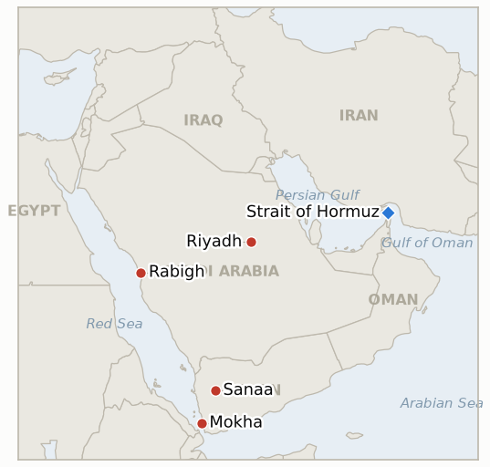

# Middle East Daily Briefing

**October 6, 2026**

- **Reporting window:** ~24 hours, October 5, 06:00 to October 6, 06:00 KST
- **Overall assessment:** Yemen's Saudi backed government turned its declared offensive into ground and naval operations, claiming Mokha and positions near Bab el-Mandeb, while the Houthis answered with claimed strikes on Riyadh's airport and the Rabigh refinery that Riyadh has not confirmed (§1.1, §1.2). A third tanker was hit near Hormuz and Iran's president rejected talks with Washington (§1.3). Brent still fell 1.9% to $100.32, because Aramco's deep Asia price cut and recovering Gulf exports outweighed the Yemen risk (§1.4).

**Corrections and updates:** The October 5 brief (§1.4, §3) said Korea's market "reopens Monday." KRX was in fact closed on October 5, a substitute holiday for National Foundation Day, which fell on Saturday October 3. The first Korean session since Friday's KOSPI 7,003.74 and won 1,350.6 is therefore Tuesday, October 6, and Monday's Brent move had no KOSPI or won reading to be tested against.

---

## 1. What Happened

<figure style="float:right; width:46%; margin:2pt 0 8pt 14pt;">

<figcaption style="font-size:8pt; color:#666; text-align:center; margin-top:3pt; font-style:italic;">Major places of discussion</figcaption>
</figure>

### 1.1 Yemen's government pushes a broad offensive and claims Mokha

Saudi backed Yemeni forces began a campaign to retake all Houthi held territory, with Yemen's military claiming more than 1,000 strikes on Houthi positions, a Saudi led naval operation in the Hodeidah governorate on Monday, and a strategic assault on Sanaa announced ([CBS News live updates](https://www.cbsnews.com/live-updates/iran-war-trump-us-oil-prices-yemen-red-sea-houthis-bab-el-mandeb/)). Government forces said they retook positions near the Bab el-Mandeb Strait, and Iran International reported the port of Mokha was retaken ([Iran International](https://www.iranintl.com/en/liveblog/202610033293)). The Houthis denied losing ground, and none of the territorial claims has independent confirmation. **Confidence: High that a ground and naval offensive began; Low on Mokha and Bab el-Mandeb gains and on the 1,000 strike figure (government sources, Houthis deny).**

### 1.2 The Houthis claim strikes on Riyadh's airport and the Rabigh refinery

The Houthis said they fired ballistic and cruise missiles and drones at King Khalid International Airport in Riyadh and an Aramco refinery in Rabigh, on the Red Sea coast, citing 60 Saudi air and missile strikes in the previous 24 hours; no Saudi confirmation was reported ([Newsquawk](https://www.newsquawk.com/headlines/houthi-spokesperson-says-in-response-to-the-saudi-aggression-they-carried-out-three-qualitative-military-operations-using-a-large-number-of-ballistic-and-cruise-missiles-and-drones)). Reports conflict on Saudi Arabia's East-West pipeline after a Sunday strike: an energy source told AFP it "stopped again," while Reuters and Bloomberg sources said oil kept flowing normally ([CBS News](https://www.cbsnews.com/live-updates/iran-war-trump-us-oil-prices-yemen-red-sea-houthis-bab-el-mandeb/)). No Saudi or Aramco statement confirmed damage at Khurais or Rabigh in the window. **Confidence: Medium that the claims were made; Low on any damage; Low on the pipeline status (sources conflict).**

### 1.3 A third tanker is hit near Hormuz and Iran's president rejects talks

A third tanker was struck near the Strait of Hormuz on Monday after two hits the previous day, and the Revolutionary Guards ordered another vessel to turn back or be attacked, according to UKMTO as reported by CBS; Fars claimed Iran targeted 13 "violators" over seven days ([Iran International](https://www.iranintl.com/en/liveblog/202610033293)). President Pezeshkian said negotiations with Washington were meaningless because the US attacked Iran after earlier talks, while officials separately said they were reviewing the US response and preparing a counterproposal ([CBS News](https://www.cbsnews.com/live-updates/iran-war-trump-us-oil-prices-yemen-red-sea-houthis-bab-el-mandeb/)). Kpler counted only 4 commodity carriers through Hormuz on October 3, against a recent 10 day average of 15, per Korean press reports. Trump separately warned Iran would "suffer greatly" if it sent combat drones to Britain. **Confidence: Medium on the tanker hits and the turn back (UKMTO via secondary outlets); High that Pezeshkian made the statement; Low on Fars's 13 vessel claim (Iranian state aligned source).**

### 1.4 Brent falls 1.9% to $100.32 on an Aramco price cut and rising Gulf exports

Brent settled at $100.32 and WTI at $89.43, both down about 1.9% and 1.8%, as Aramco cut November Arab Light for Asia to $5 a barrel below its regional benchmark, far deeper than the $2 discount for October and larger than refiners surveyed by Bloomberg expected, and as Middle East exports recovered and the G7 stock release began to be counted ([CNBC via search summary](https://www.cnbc.com/2026/10/05/oil-slips-as-middle-east-crude-exports-rise-g7-to-release-stocks.html); [Tradersunion](https://tradersunion.com/news/commodities/show/3661505-oil-falls/)). Yemen fighting and the pipeline reports kept trading volatile but did not reverse the decline. Bessent separately said Iranian crude loadings fell to zero in September under US sanctions pressure ([Iran International](https://www.iranintl.com/en/liveblog/202610033293)). **Confidence: High on the settles (two sources agree on direction and size); Medium on the causal attribution.**

---

## 2. Deep Dive: Incentives and Motives

### 2.1 Why is Riyadh pairing a Yemeni offensive with a deep Asia price cut?

Because the two moves answer different pressures. The offensive uses a Yemeni political face to push the Houthis back from the Red Sea coast that carries Saudi exports around Hormuz. The $5 discount for Asia defends market share with Korea, Japan, India and China while Gulf exports are recovering and rival suppliers are lining up, and it signals that Saudi supply is available even as Houthi claims target its facilities. Cutting price while claiming no damage is also a way of telling buyers the system is intact.

### 2.2 Why do the Houthis claim an airport and a refinery now?

Because the offensive threatens their coastal holdings and claimed strikes on Saudi civil and energy sites are the cheapest way to raise Riyadh's cost of backing it. Naming Rabigh, on the Red Sea, and Riyadh's airport extends the threat to the export route that the East-West pipeline feeds. Unconfirmed claims still move shipping insurance and sentiment, even when Brent fell on the day.

### 2.3 Why would Iran's president dismiss talks while officials prepare a counterproposal?

Because the two lines serve different audiences. Pezeshkian's rejection speaks to a domestic hardline camp that has attacked the diplomatic channel since late September, while the foreign ministry keeps a reply ready so Tehran can say it never walked away. Leaving tanker attacks unclaimed preserves leverage without a formal escalation. The risk is timing: the third US carrier is due in late October, so room for delay narrows.

---

## 3. Policy Implications for South Korea

**Exposure snapshot:** South Korea draws about 70.7% of its crude and 20.4% of its LNG from the Middle East ([KITA](https://www.kita.net/board/totalTradeNews/totalNewsExistDetail.do?no=99558); `instructions/korea-exposure.md`, no update needed). Korean press citing Opinet put the national average gasoline price at 1,807.1 won per liter on the morning of October 5, up 29.6 won from the previous day, and Dubai crude at $99.9 a barrel for the first week of the month, up $7.6 on the week. Brent's October 5 settle of $100.32 sets the reference for Tuesday's session; KOSPI and the won have no reading since Friday (7,003.74 and 1,350.6).

**Implications by development:**

- **Offensive in Yemen (§1.1):** a Saudi backed push toward Mokha and Bab el-Mandeb touches the Red Sea route, including Yanbu loadings, that Korean refiners count on as the Hormuz alternative; gains would help, a Houthi counterstrike on that coast would hurt.
- **Rabigh and Riyadh claims (§1.2):** Saudi Arabia is a core Korean crude supplier, so confirmed damage at Rabigh or Khurais would hit supply, not just price; no confirmation so far.
- **Aramco's Asia price cut (§1.4):** the $5 discount for November cargoes lowers Korea's crude import cost at the margin and is the strongest near term offset to the war premium for Korean refiners.
- **Hormuz (§1.3):** transits remain a fraction of normal and more tankers are being hit, which keeps the Hormuz deployment question (IND-20260928-2) live; no new Korean government statement appeared in the window.
- **Pump prices (§3 snapshot):** domestic gasoline rose despite Brent falling, a lag from earlier Dubai gains; Tuesday's KOSPI and won open is the first test of Monday's oil move.

**Testable indicators:**

- **IND-20261006-1** (open, new): Saudi Arabia, Aramco, or independent imagery confirms damage at the Rabigh refinery or Riyadh's airport by ~2026-10-13; an explicit Saudi denial, or no confirmation by that date, falsifies it.
- **IND-20261006-2** (open, new): Aramco's $5 Asia discount and Gulf export recovery hold Brent below $100 at a daily settle by ~2026-10-16; no settle below $100 falsifies it.
- **IND-20261003-1** (resolved, confirmed): Yemen's government launched the ground and naval offensive on the Red Sea coast and Mokha (§1.1), well ahead of the ~2026-10-23 deadline; territorial gains remain disputed and are not part of the test.
- **IND-20261005-1** (open): no Saudi confirmation of Khurais damage and Brent at $100.32, below $105; stays open to ~2026-10-12 but trending toward falsification.
- **IND-20261004-1** (open): Aramco confirmation of the Riyadh area fire; still unconfirmed, deadline ~2026-10-11.
- **IND-20261004-2** (open): Theodore Roosevelt group reported in the CENTCOM area; no arrival report, deadline ~2026-10-25.
- **IND-20261003-2** (open): Brent below $95; settled $100.32, deadline ~2026-10-16.
- **IND-20261002-2** (open): attribution of the burning tanker; two more hits on Sunday and Monday, still unattributed, deadline ~2026-10-09.
- **IND-20261002-1**, **IND-20261001-1**, **IND-20261001-2**, **IND-20260927-3**, **IND-20260930-1**, **IND-20260929-1**, **IND-20260930-2**, **IND-20260928-1**, **IND-20260928-2**, **IND-20260928-3**, **IND-20260714-4** (open): no resolving information; Iran's reply to the US response (IND-20260930-1, IND-20261001-1) is still described as under review, with Pezeshkian rejecting talks in public.

---

## 4. Watch List

- **Whether Mokha and Bab el-Mandeb gains hold, and whether Sanaa is attacked on the ground (IND-20261003-1 follow on).**
- **Saudi or Aramco statement on Rabigh, Riyadh airport and Khurais (IND-20261006-1, IND-20261005-1, IND-20261004-1).**
- **Status of the East-West pipeline, given conflicting reports.**
- **Tuesday's KOSPI and won open, the first Korean reading in four days (IND-20261001-2).**
- **Whether Brent settles below $100 (IND-20261006-2).**
- **Iran's formal reply to the US text on Hormuz sequencing (IND-20261001-1).**

---

## 5. Source Quality Summary

| Claim | Sources | Confidence |
| --- | --- | --- |
| Yemeni offensive launched; Mokha and Bab el-Mandeb claims | CBS News, Iran International | High on launch; Low on gains (Houthis deny) |
| Houthi claims on Riyadh airport and Rabigh refinery | Newsquawk, Iran International | Medium on claim; Low on damage |
| East-West pipeline status | CBS News (AFP vs Reuters and Bloomberg) | Low, conflicting |
| Third tanker hit, IRGC turn back, Pezeshkian rejects talks | CBS News, Iran International | Medium |
| Brent $100.32, WTI $89.43, Aramco Asia discount | CNBC (via search summary), Tradersunion | High on levels; Medium on causes |
| KRX closed October 5 | KRX holiday calendars | High |
| Kpler Hormuz count of 4 on October 3; Opinet gasoline 1,807.1 won | Korean press citing Kpler and Opinet (secondary) | Medium |
