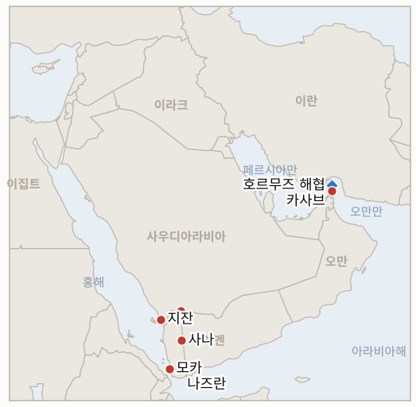

# 중동 일일 브리핑

**2026년 10월 7일**

- **보고 기간:** 약 24시간, 10월 6일 06:00 ~ 10월 7일 06:00 (한국시간)
- **종합 평가:** 후티의 대사우디 공세가 주장 단계에서 확인 단계로 넘어갔다. 사우디 민간항공당국이 지잔과 나즈란 두 공항에 대한 공격을 인정하고 경상자 3명을 밝혔으나, 리야드와 라비그 관련 주장은 여전히 확인되지 않았다(§1.1). 예멘 지상전은 모카와 두바브의 장악을 둘러싼 상반된 주장 속에 이어졌고(§1.2), 호르무즈 인근 유조선 공격은 10월 들어 9건에 이르렀으며 인도인 선원이 다쳤다(§1.3). 브렌트유는 100달러 아래로 잠시 내려갔다가 100.58달러를 유지했고, 코스피는 나흘 만의 첫 거래일에 0.89% 하락했다(§1.4).

---

## 1. 무슨 일이 있었나

<figure style="float:right; width:46%; margin:2pt 0 8pt 14pt;">

<figcaption style="font-size:8pt; color:#666; text-align:center; margin-top:3pt; font-style:italic;">주요 논의 지점</figcaption>
</figure>

### 1.1 사우디가 후티의 공항 두 곳 공격을 확인한다

사우디 민간항공당국은 지잔과 나즈란으로 보도된 두 공항에 대한 공격을 확인하며 경상자 3명과 재산 피해가 있었다고 밝혔고, 걸프협력회의(GCC) 사무총장은 이를 "노골적인" 공격이라고 규탄했다([The National 실시간](https://www.thenationalnews.com/news/mena/2026/10/06/live-iran-war-yemen-houthis-latest/); [Al Jazeera 실시간](https://www.aljazeera.com/news/liveblog/2026/10/6/iran-war-live-yemen-forces-reclaim-strategic-port-city-mocha-from-houthis)). 연합군은 카미스 무샤이트를 향한 탄도미사일을 요격하고 후티 무기 시설을 타격했다고 밝혔으며, 루비오 국무장관은 사우디의 자위권을 확인했다. 리야드 킹칼리드 공항과 라비그 정유시설에 대한 후티의 앞선 주장은 보고 기간에도 사우디의 확인이 없었다. **신뢰도: 높음(두 공항 공격 발생, 사우디 당국과 복수 매체); 낮음(리야드·라비그 피해, 후티 주장뿐).**

### 1.2 예멘 전투가 확산되고 모카와 두바브는 여전히 다툼 중이다

Al Jazeera 실시간 보도는 예멘군이 항구 도시 모카를 탈환했다고 전했고, 전략 요충지 두바브 일대에서는 장악 주체를 두고 주장이 엇갈리는 가운데 전투가 이어졌다([Al Jazeera 실시간](https://www.aljazeera.com/news/liveblog/2026/10/6/iran-war-live-yemen-forces-reclaim-strategic-port-city-mocha-from-houthis); [CBS 실시간](https://cbsnews.com/live-updates/iran-war-trump-us-oil-prices-yemen-red-sea-houthis-bab-el-mandeb)). 후티는 "모든 성과에 대한 완전한 통제"를 유지한다며 정부 측 전투원 200명 이상을 사살하거나 부상시켰다고 주장했고, 정부는 사나에서 "전략 공세"를 시작했다고 밝혔다. 8월 이후 예멘 전투로 18만 4천 명 이상이 피란했다. **신뢰도: 중간(전투가 격렬하고 정부군이 모카를 주장한다는 점); 낮음(모카·두바브 장악 주체와 사상자 수치, 양측 모두 당파적).**

### 1.3 호르무즈 인근 유조선 공격이 10월 들어 9건에 이르고 인도인 선원이 다친다

파나마 선적 선박에서 선원 12명(인도인 11명)이 오만 앞바다에서 부상했고, UKMTO는 10월 들어 해협에서 유조선 공격 9건을 집계했다. 6일 만에 9월 한 달 건수의 절반 수준이며, 인도는 공격을 규탄했다([Rigzone](https://www.rigzone.com/news/oil_steady_as_middle_east_exports_rise-06-oct-2026-184788-article); [CBS 실시간](https://cbsnews.com/live-updates/iran-war-trump-us-oil-prices-yemen-red-sea-houthis-bab-el-mandeb)). Straits.live는 10월 4일 통항을 위기 이전 기준 85척 대비 4척으로 집계하고 이란이 해협 봉쇄를 유지한다고 밝혔다고 전했다. 반면 에너지인텔리전스포럼의 업계 임원들은 최근 7~10일간 하루 약 1,200만 배럴의 원유가 해협을 빠져나갔다고 밝혔는데, 집계 기준이 다르다([Straits.live](https://straits.live/briefs/2026-10-06)). 아락치는 군사적 해법도 제재 해법도 없다며 이란이 "전보다 더 준비돼 있다"고 말했고, 테헤란은 미국이나 이스라엘의 오판에 "더 가혹한" 대응을 경고했다([Gulf News](https://gulfnews.com/world/mena/us-iran-war-tehran-rejects-military-solution-saudi-led-coalition-backs-yemen-offensive-against-houthis-1.500698388)). **신뢰도: 높음(공격 건수와 부상 선원, UKMTO와 인도 정부 발표를 인용한 매체); 중간(통항 집계, 제3자 추적 서비스이며 기준이 엇갈림); 중간(이란 발언, 전언).**

### 1.4 브렌트유는 100달러 아래로 내려갔다가 100.58달러를 유지하고 코스피는 개장일에 하락한다

브렌트유 12월물은 0.3% 오른 100.58달러, WTI는 89.44달러에 정산됐다. 브렌트유는 중동 수출 증가와 아람코의 6년 만의 최저 수준 아시아 가격 때문에 장중 최대 3.3% 하락했다. 사우디는 동서 송유관으로 하루 580만 배럴을 보내고 있으며 쿠웨이트는 전쟁 이전 생산량의 약 75%를 가동한다([Rigzone](https://www.rigzone.com/news/oil_steady_as_middle_east_exports_rise-06-oct-2026-184788-article)). 서울에서는 코스피가 10월 2일 이후 첫 거래일에 62.35포인트(0.89%) 내린 6,941.39에 마감했고, 코스닥은 2.98% 오른 919.92, 원화는 달러당 1,343.6원에 마감했다([뉴스핌](https://www.newspim.com/news/view/20261006001191)). **신뢰도: 높음(정산가와 한국 마감, 한국 수치는 단일 보도이나 직전 종가 계산과 일치); 중간(인과 관계).**

---

## 2. 심층 분석: 유인과 동기

### 2.1 후티는 왜 리야드만이 아니라 남부 공항을 타격하는가?

지잔, 나즈란, 카미스 무샤이트는 후티 발사 지역에서 가깝고 사우디 방공망을 저비용으로 시험할 수 있기 때문이다. 민간 항공 타격은 사우디 석유 수출 시설을 치는 것처럼 더 강한 보복을 부르는 선을 넘지 않으면서 리야드의 국내외 이미지에 비용을 안긴다. 리야드와 라비그 주장과 달리 이번 공격을 사우디가 직접 확인한 것도 사우디 외교에 유리하다. 캠페인을 방어적인 것으로 규정하고 루비오의 발언을 뒷받침하기 때문이다.

### 2.2 석유 수출이 회복되는데도 테헤란은 왜 호르무즈 봉쇄 주장을 유지하는가?

해운사가 여전히 할증료를 내고 보험사가 주저하는 한, 봉쇄 주장은 비용이 거의 들지 않는 협상 카드이기 때문이다. 주체를 밝히지 않는 공격은 부인 가능성을 남기고, 기록된 통항 4척과 원유 흐름 회복을 전하는 임원들의 보고 사이의 간극은 봉쇄가 물리적 차단이라기보다 위험 프리미엄으로 작동함을 보여준다. 아락치가 "더 준비돼 있다"고 한 것은 새로운 타격에 대응 태세가 갖춰져 있다고 워싱턴에 알리는 신호다.

### 2.3 사우디 공항이 공격받았는데 유가는 왜 오르지 않았는가?

사우디의 수출 능력이 타격받지 않았기 때문이다. 시장은 확인된 남부 공항 공격을 공급 손실이 아닌 괴롭히기로 해석했고, 아람코의 가격 인하가 공급 여력을 시사하는 데다 동서 송유관이 하루 580만 배럴을 유지하고 G7 비축유 방출이 진행 중이다. 라비그나 얀부에 대한 타격이 확인되면 이 판단은 달라진다.

---

## 3. 한국에 대한 정책적 시사점

**노출도 요약:** 한국은 원유의 약 70.7%, LNG의 약 20.4%를 중동에서 들여온다([KITA](https://www.kita.net/board/totalTradeNews/totalNewsExistDetail.do?no=99558); `instructions/korea-exposure.md`, 갱신 불필요). 10월 6일 코스피 종가 6,941.39는 10월 2일의 7,003.74와 비교되며, 브렌트유 정산가 100.58달러가 10월 7일 장의 기준점이다. 원화 종가 1,343.6원은 오후 종가 기준이다. 뉴스핌은 직전 기준보다 0.4원 낮다고 전했으나 10월 2일 기록된 종가 1,350.6원과 맞지 않으므로 전일 대비 변동은 신중하게 봐야 한다.

**전개별 시사점:**

- **사우디 공항 공격(§1.1):** 확인된 표적은 남부의 민간 공항이지 수출 시설이 아니므로 당분간 한국의 사우디산 원유 공급에는 영향이 없다. 라비그나 리야드 타격이 확인되면(IND-20261006-1) 달라진다.
- **예멘 전투(§1.2):** 모카와 바브엘만데브 연안의 통제권은 한국 정유사가 호르무즈 대안으로 쓰는 홍해 경로와 관련된다. 확인되지 않은 전과는 아직 계획을 바꾸지 않는다.
- **호르무즈 공격(§1.3):** 인도인 선원 피해는 해협 통항의 정치적 비용을 높이고 서울의 호르무즈 파병 문제(IND-20260928-2)에 대한 압박을 유지한다. 보고 기간에 새로운 한국 정부 입장은 없었다.
- **시장(§1.4):** 코스피 0.89% 하락과 코스닥 2.98% 상승은 연휴 후 첫 거래일에 공포가 아닌 순환매가 나타났음을 보여준다. 당일 외국인 수급 자료는 찾지 못해 IND-20261001-2는 열린 상태로 남는다.

**검증 가능한 지표:**

- **IND-20261007-1**(진행 중, 신규): 정부군의 모카 통제가 독립 보도(로이터, AP 또는 현지 취재 매체)로 확인되고 2026-10-16경까지 뒤집히지 않는다. 후티의 재탈환이나 그 시점까지 독립 확인이 없으면 반증된다.
- **IND-20261007-2**(진행 중, 신규): UKMTO가 보고한 호르무즈 안팎 선박 공격이 2026-10-20경까지 10월 누계 20건 이상에 이른다(10월 6일까지 9건). 그 시점까지 20건에 못 미치면 반증된다.
- **IND-20261006-1**(진행 중): 사우디 당국이 지잔·나즈란 공항 공격은 확인했으나 리야드와 라비그는 확인하지 않았다. 2026-10-13경까지 열려 있다.
- **IND-20261006-2**(진행 중): 브렌트유는 장중 100달러 아래로 내려갔다가 100.58달러에 정산했다. 기한 2026-10-16경.
- **IND-20261005-1**(진행 중): 쿠라이스 확인이 없고 브렌트유는 105달러 아래다. 기한 2026-10-12경, 반증 쪽으로 기운다.
- **IND-20261004-1**(진행 중): 리야드 인근 화재에 대한 아람코의 확인이 아직 없다. 기한 2026-10-11경.
- **IND-20261003-2**(진행 중): 브렌트유 95달러 하회는 이뤄지지 않았다. 기한 2026-10-16경.
- **IND-20260930-1**(진행 중, 기한 2026-10-07경): 순서 문제에 대한 미국의 답변이 공개되지 않았다. 오늘이 끝날 때까지 미공개면 반증으로 해결된다.
- **IND-20261004-2**, **IND-20261002-2**, **IND-20261002-1**, **IND-20261001-1**, **IND-20261001-2**, **IND-20260927-3**, **IND-20260929-1**, **IND-20260930-2**, **IND-20260928-1**, **IND-20260928-2**, **IND-20260928-3**, **IND-20260714-4**(진행 중): 보고 기간에 해결할 정보 없음.

---

## 4. 관찰 목록

- **모카와 두바브를 누가 장악했는지에 대한 독립 확인(IND-20261007-1).**
- **라비그, 리야드 공항, 쿠라이스에 대한 사우디의 입장(IND-20261006-1, IND-20261005-1, IND-20261004-1).**
- **호르무즈 유조선 공격 10월 누계와 선원 피해(IND-20261007-2).**
- **브렌트유가 100달러 아래에서 정산하는지(IND-20261006-2).**
- **호르무즈 순서 문제에 대한 미국의 답변, 오늘 기한(IND-20260930-1).**
- **이번 주 코스피 외국인 수급(IND-20261001-2).**

---

## 5. 출처 품질 요약

| 주장 | 출처 | 신뢰도 |
|---|---|---|
| 사우디 민간항공당국의 지잔·나즈란 공항 공격 확인 | The National, Al Jazeera 실시간 | 높음 |
| 리야드·라비그 주장 미확인 | The National, CBS, Al Jazeera에 확인 없음 | 중간 |
| 모카 탈환, 두바브 다툼 | Al Jazeera, CBS | 낮음~중간, 당파적 주장 |
| 10월 UKMTO 유조선 공격 9건, 선원 12명 부상 | Rigzone(블룸버그 기반), CBS | 높음 |
| 10월 4일 호르무즈 통항 4척, 하루 1,200만 배럴 유출 | Straits.live, 에너지인텔리전스포럼(Rigzone 경유) | 중간, 기준 엇갈림 |
| 브렌트유 100.58달러, WTI 89.44달러 | Rigzone | 높음 |
| 코스피 6,941.39, 코스닥 919.92, 원화 1,343.6원 | 뉴스핌 | 지수는 높음, 환율 기준은 중간 |
