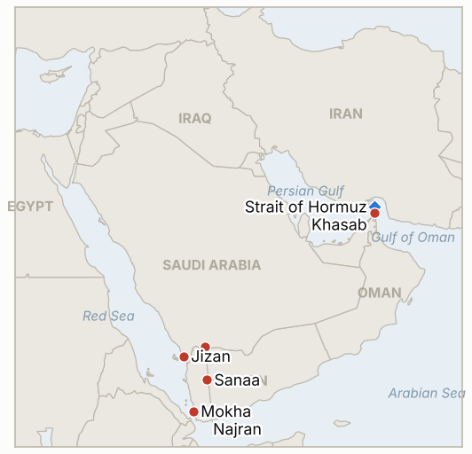

# Middle East Daily Briefing

**October 7, 2026**

- **Reporting window:** ~24 hours, October 6, 06:00 to October 7, 06:00 KST
- **Overall assessment:** The Houthi campaign against Saudi Arabia moved from claims to confirmation: Saudi Arabia's aviation authority acknowledged attacks on two airports, Jizan and Najran, with three minor injuries, while the Riyadh and Rabigh claims remain unconfirmed (§1.1). Ground fighting in Yemen continued with competing claims over Mokha and Dhubab (§1.2), and tanker attacks near Hormuz reached nine in October with Indian crew wounded (§1.3). Brent held at $100.58 after briefly dipping below $100, and KOSPI fell 0.89% in its first session in four days (§1.4).

---

## 1. What Happened

<figure style="float:right; width:46%; margin:2pt 0 8pt 14pt;">

<figcaption style="font-size:8pt; color:#666; text-align:center; margin-top:3pt; font-style:italic;">Major places of discussion</figcaption>
</figure>

### 1.1 Saudi Arabia confirms Houthi attacks on two airports

Saudi Arabia's aviation authority confirmed attacks on two airports, reported as Jizan and Najran, with three minor injuries and property damage, and the GCC secretary general condemned the "flagrant" strikes ([The National live blog](https://www.thenationalnews.com/news/mena/2026/10/06/live-iran-war-yemen-houthis-latest/); [Al Jazeera live](https://www.aljazeera.com/news/liveblog/2026/10/6/iran-war-live-yemen-forces-reclaim-strategic-port-city-mocha-from-houthis)). The coalition said it intercepted a ballistic missile aimed at Khamis Mushait and struck Houthi weapon sites, and Secretary of State Rubio affirmed Saudi Arabia's right to defend itself. The earlier Houthi claims on Riyadh's King Khalid airport and the Rabigh refinery still have no Saudi confirmation in the window. **Confidence: High that the two airport attacks occurred (Saudi authority, multiple outlets); Low on Riyadh and Rabigh damage (Houthi claims only).**

### 1.2 Fighting in Yemen spreads while Mokha and Dhubab remain contested

Al Jazeera's live coverage reported Yemeni forces reclaiming the port city of Mokha, while fighting continued around the strategic town of Dhubab with conflicting claims of control ([Al Jazeera live](https://www.aljazeera.com/news/liveblog/2026/10/6/iran-war-live-yemen-forces-reclaim-strategic-port-city-mocha-from-houthis); [CBS live](https://cbsnews.com/live-updates/iran-war-trump-us-oil-prices-yemen-red-sea-houthis-bab-el-mandeb)). The Houthis said they retain "full control over all their gains" and claimed more than 200 government aligned fighters killed or wounded, and the government said its armed forces had begun a "strategic offensive" in Sanaa. More than 184,000 people have been displaced by Yemen fighting since August. **Confidence: Medium that fighting is intense and Mokha is claimed by government forces; Low on who holds Mokha and Dhubab and on casualty figures (both sides partisan).**

### 1.3 Tanker attacks near Hormuz reach nine in October, with Indian crew wounded

Twelve crew, eleven of them Indian nationals, were wounded aboard a Panama flagged vessel off Oman, and UKMTO has recorded nine tanker attacks in the waterway in October, about half September's monthly total in six days; India condemned the attacks ([Rigzone](https://www.rigzone.com/news/oil_steady_as_middle_east_exports_rise-06-oct-2026-184788-article); [CBS live](https://cbsnews.com/live-updates/iran-war-trump-us-oil-prices-yemen-red-sea-houthis-bab-el-mandeb)). Straits.live counted only 4 transits on October 4 against a pre crisis baseline of 85, and said Iran maintains the strait is closed, while industry executives at the Energy Intelligence Forum said about 12 million barrels a day of crude have exited the strait over the past seven to 10 days, a different basis ([Straits.live](https://straits.live/briefs/2026-10-06)). Araghchi said there is no military or sanctions solution and Iran is "more prepared than before," and Tehran warned of a "more severe" response to any US or Israeli miscalculation ([Gulf News](https://gulfnews.com/world/mena/us-iran-war-tehran-rejects-military-solution-saudi-led-coalition-backs-yemen-offensive-against-houthis-1.500698388)). **Confidence: High on the attack tally and wounded crew (UKMTO, Indian government via outlets); Medium on transit counts (third party tracker, bases conflict); Medium on Iranian statements (relayed).**

### 1.4 Brent holds $100.58 after dipping below $100, and KOSPI falls on reopening

Brent December settled at $100.58, up 0.3%, and WTI at $89.44, after Brent fell as much as 3.3% earlier on rising Middle East exports and Aramco's six year low Asia price; Saudi Arabia is pumping 5.8 million barrels a day through its East-West pipeline and Kuwait runs at about 75% of pre war output ([Rigzone](https://www.rigzone.com/news/oil_steady_as_middle_east_exports_rise-06-oct-2026-184788-article)). In Seoul, KOSPI closed at 6,941.39, down 62.35 points or 0.89%, in its first session since October 2, while KOSDAQ rose 2.98% to 919.92 and the won closed at 1,343.6 per dollar ([Newspim](https://www.newspim.com/news/view/20261006001191)). **Confidence: High on the settles and Korean closes (single report for Korea, consistent with prior close arithmetic); Medium on causation.**

---

## 2. Deep Dive: Incentives and Motives

### 2.1 Why do the Houthis hit Saudi airports in the south rather than only Riyadh?

Because Jizan, Najran and Khamis Mushait sit within short range of Houthi launch areas and test Saudi air defenses cheaply, while civil aviation hits impose costs on Riyadh's domestic and international image without crossing the threshold of a strike on Saudi oil exports that would invite harsher retaliation. Riyadh's confirmation of these attacks, unlike the Riyadh and Rabigh claims, also suits Saudi diplomacy: it frames the campaign as defensive and supports Rubio's statement.

### 2.2 Why does Tehran keep the Hormuz closure claim alive while oil exports recover?

Because the closure claim is leverage that costs little as long as shippers still pay premiums and insurers hesitate. Attacks that stay unclaimed keep deniability, and the gap between 4 recorded transits and executives' reports of recovering crude flows shows the closure functions as a risk premium rather than a physical blockade. Araghchi's promise of being "more prepared" tells Washington that a renewed strike would meet a ready response.

### 2.3 Why did oil not rise when Saudi airports were hit?

Because Saudi export capacity was not hit. Markets priced the confirmed attacks on southern airports as harassment, not supply loss, against Aramco's discount signaling plentiful supply, the East-West pipeline running at 5.8 million barrels a day and the G7 stock release. A confirmed hit on Rabigh or Yanbu would change that reading.

---

## 3. Policy Implications for South Korea

**Exposure snapshot:** South Korea draws about 70.7% of its crude and 20.4% of its LNG from the Middle East ([KITA](https://www.kita.net/board/totalTradeNews/totalNewsExistDetail.do?no=99558); `instructions/korea-exposure.md`, no update needed). KOSPI's 6,941.39 close on October 6 compares with 7,003.74 on October 2; Brent's $100.58 settle sets the reference for the October 7 session. The won's 1,343.6 close is on the afternoon basis; Newspim states it was 0.4 won lower than a prior reference, which does not match the 1,350.6 close recorded October 2, so treat the day over day move cautiously.

**Implications by development:**

- **Saudi airport attacks (§1.1):** the confirmed targets are civil airports in the south, not export facilities, so Korean crude supply from Saudi Arabia is unaffected for now; a confirmed Rabigh or Riyadh hit (IND-20261006-1) would change that.
- **Yemen fighting (§1.2):** control of Mokha and the Bab el-Mandeb coast bears on the Red Sea route that Korean refiners use as the Hormuz alternative; unconfirmed gains do not yet change planning.
- **Hormuz attacks (§1.3):** Indian crew casualties raise the political cost of shipping through the strait and sustain pressure on Seoul's pending Hormuz deployment question (IND-20260928-2); no new Korean government statement appeared in the window.
- **Markets (§1.4):** a 0.89% KOSPI fall alongside a 2.98% KOSDAQ gain shows rotation, not panic, in the first session after the holiday; foreign flow data for the day were not found, so IND-20261001-2 stays open.

**Testable indicators:**

- **IND-20261007-1** (open, new): Government forces' control of Mokha is confirmed by independent reporting (Reuters, AP, or a named on the ground outlet) and not reversed by ~2026-10-16; a Houthi recapture or no independent confirmation by that date falsifies it.
- **IND-20261007-2** (open, new): UKMTO reported attacks on shipping in or near Hormuz reach 20 or more for October by ~2026-10-20 (nine by October 6); fewer than 20 by that date falsifies it.
- **IND-20261006-1** (open): Saudi authorities confirmed attacks on Jizan and Najran airports but not Riyadh or Rabigh; stays open to ~2026-10-13.
- **IND-20261006-2** (open): Brent settled $100.58, above $100 after an intraday dip below; deadline ~2026-10-16.
- **IND-20261005-1** (open): no Khurais confirmation, Brent below $105; deadline ~2026-10-12, trending toward falsification.
- **IND-20261004-1** (open): no Aramco confirmation of the Riyadh area fire; deadline ~2026-10-11.
- **IND-20261003-2** (open): Brent below $95 not reached; deadline ~2026-10-16.
- **IND-20260930-1** (open, due ~2026-10-07): no disclosed US response on sequencing; resolves falsified if still undisclosed at day end.
- **IND-20261004-2**, **IND-20261002-2**, **IND-20261002-1**, **IND-20261001-1**, **IND-20261001-2**, **IND-20260927-3**, **IND-20260929-1**, **IND-20260930-2**, **IND-20260928-1**, **IND-20260928-2**, **IND-20260928-3**, **IND-20260714-4** (open): no resolving information in the window.

---

## 4. Watch List

- **Independent confirmation of who holds Mokha and Dhubab (IND-20261007-1).**
- **Any Saudi statement on Rabigh, Riyadh airport or Khurais (IND-20261006-1, IND-20261005-1, IND-20261004-1).**
- **October tally of Hormuz tanker attacks and crew casualties (IND-20261007-2).**
- **Whether Brent settles below $100 (IND-20261006-2).**
- **US reply on Hormuz sequencing, due today (IND-20260930-1).**
- **Foreign investor flows in KOSPI this week (IND-20261001-2).**

---

## 5. Source Quality Summary

| Claim | Sources | Confidence |
| --- | --- | --- |
| Saudi aviation authority confirms Jizan and Najran airport attacks | The National, Al Jazeera live | High |
| Riyadh and Rabigh claims unconfirmed | Absence in The National, CBS, Al Jazeera | Medium |
| Mokha reclaimed; Dhubab contested | Al Jazeera, CBS | Low to Medium, partisan claims |
| Nine UKMTO tanker attacks in October; 12 crew wounded | Rigzone (Bloomberg based), CBS | High |
| Hormuz 4 transits Oct 4; 12 mb/d crude exits | Straits.live, Energy Intelligence Forum via Rigzone | Medium, bases conflict |
| Brent $100.58, WTI $89.44 | Rigzone | High |
| KOSPI 6,941.39, KOSDAQ 919.92, won 1,343.6 | Newspim | High on index, Medium on won basis |
