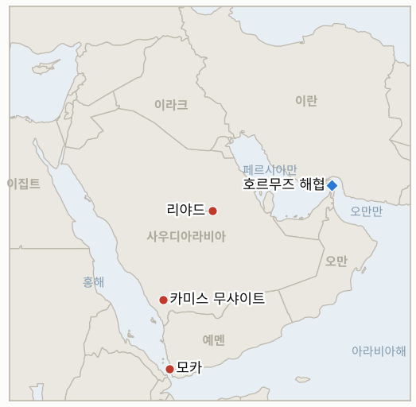

# 중동 일일 브리핑

**2026년 10월 8일**

- **보고 기간:** 약 24시간, 10월 7일 06:00 ~ 10월 8일 06:00 (한국시간)
- **종합 평가:** 후티의 대사우디 공세가 이어져, 리야드 킹 칼리드 공항을 겨냥한 탄도미사일을 연합군이 요격했다고 밝혔고, 사우디 에너지장관은 동서 송유관 수송량이 하루 580만 배럴이라고 말했다(§1.1). 예멘 지상전은 하루 약 270명이 숨졌으나 모카와 두바브를 누가 쥐었는지는 독립적으로 검증되지 않았다(§1.2). 이란은 압박에 호르무즈를 열지 않겠다고 하면서도 미국의 답신을 검토 중이라고 밝혔다(§1.3). 코스피는 외국인 3조 1천억 원 순매도 속에 1.98% 내렸고 브렌트유는 장중 101달러 안팎이다(§1.4). 보고 기간의 보도는 많지 않다. 아래 일부 항목은 미국 시간 10월 6일 밤에 처음 보도되었으나 현재 상황을 규정하므로 함께 싣는다.

---

## 1. 무슨 일이 있었나

<figure style="float:right; width:46%; margin:2pt 0 8pt 14pt;">

<figcaption style="font-size:8pt; color:#666; text-align:center; margin-top:3pt; font-style:italic;">주요 논의 지점</figcaption>
</figure>

### 1.1 후티가 리야드 공항을 겨냥하고 사우디는 송유관 수송량을 강조한다

후티는 리야드 킹 칼리드 국제공항에 탄도미사일을 쐈고 항공 운항이 차질을 빚었다고 주장했으며, 연합군은 수도 북쪽에서 미사일 한 발을 요격했다고 밝혔다([CBS live](https://www.cbsnews.com/live-updates/iran-war-trump-us-oil-prices-yemen-red-sea-houthis-bab-el-mandeb/)). 사우디 에너지장관 압둘아지즈 빈 살만 왕자는 동서 송유관 수송량이 하루 580만 배럴로 회복되었다며 또 다른 가동 중단 보도를 반박했고, 사우디 당국은 앞서 남부 공항 두 곳에 대한 공격을 확인한 바 있다([OilPrice](https://oilprice.com/Latest-Energy-News/World-News/Brent-Back-Above-100-as-Houthis-Hit-Saudi-Infrastructure.html)). 연합군은 카미스 무샤이트를 겨냥한 미사일도 파괴했다고 밝혔다. **신뢰도: 리야드 방향 발사 주장과 요격 보고는 높음. 항공 운항 차질은 후티 주장뿐이어서 낮음. 에너지장관의 580만 배럴 발언은 공식 주장으로서는 높음, 실제 계측치로서는 중간.**

### 1.2 예멘 지상전: 하루 약 270명 사망, 영토 주장은 검증되지 않는다

AFP는 양측 취재원을 인용해 24시간 동안 270명 넘게 숨졌다고 보도했다(정부군 115명은 정부 측 소식통, 후티 전투원 160명은 후티 측 소식통). 두바브 일대 전투는 계속되었다([CBS live](https://www.cbsnews.com/live-updates/iran-war-trump-us-oil-prices-yemen-red-sea-houthis-bab-el-mandeb/)). 예멘군은 모카와 바브엘만데브 일대에서 후티를 몰아냈다고 밝혔고, 후티는 "모든 전과를 장악하고 있다"고 맞섰으며, CBS는 어느 쪽 주장도 독립적으로 검증할 수 없다고 전했다. 튀르키예와 파키스탄은 새 상호방위동맹에 따라 사우디에 병력을 "신속 배치"하기로 했고, 구테흐스 유엔 사무총장은 후티의 국경 넘는 공격을 규탄했다. **신뢰도: 사망자 규모는 중간(양측 취재원, AFP 경유). 모카·두바브 통제권은 낮음.**

### 1.3 이란은 압박에 호르무즈를 열지 않겠다고 하고 유조선 공격은 이어진다

이란 국가안보회의 서기 모흐센 레자이는 "호르무즈는 위협이나 압박으로 열리지 않는다"고 말했다. 가리바바디 외무부 차관은 이란의 호르무즈 조건에 대한 미국의 답신을 검토 중이라고 밝혔고, 페제시키안 대통령은 미국의 재공격 이후 협상이 "무의미하다"고 말했다([CBS live](https://www.cbsnews.com/live-updates/iran-war-trump-us-oil-prices-yemen-red-sea-houthis-bab-el-mandeb/)). 영국 해사무역기구(UKMTO)는 해협을 빠져나가던 유조선이 또 피격되었다고 전했고, 인도는 파나마 선적 온 피스호에서 승조원 12명(인도인 11명)이 다쳤다고 밝혔다. 미 중부사령부(CENTCOM)는 7월 14일 이후 선박 3척을 무력화하고 130척의 항로를 변경시켰다고 했으며, 미 헬기가 격추되었다는 이란 측 주장을 부인했다. 미국 답신의 내용은 공개되지 않았다. **신뢰도: 발언 자체는 높음. 유조선 사건 세부는 중간(UKMTO). 이란의 군사 관련 주장은 낮음.**

### 1.4 외국인 매도로 코스피가 1.98% 하락하고 브렌트유는 장중 101달러 안팎이다

코스피는 137.49포인트(1.98%) 내린 6,803.90에 마감했다. 외국인은 3조 1,095억 원, 기관은 8,598억 원을 순매도했다. 코스닥은 2.34% 내린 898.43, 원화는 달러당 1,340.4원에 마감했다([뉴스핌](https://newspim.com/news/view/20261007001012); [파이낸셜뉴스](https://www.fnnews.com/news/202610071552318501)). 대신증권 연구원은 약세를 국제유가와 미 국채금리 상승 탓으로 돌렸고, 시장은 10월 8일 삼성전자의 3분기 잠정실적을 기다리며 관망했다. 브렌트유는 전날 100달러 아래로 내려갔다가 반등해 장중 101.5달러 안팎에서 거래되었다. ING는 걸프 공급 회복(비톨: 하루 약 1,200만 배럴의 원유가 걸프를 빠져나감)과 후티 위협 사이의 "줄다리기"라고 평했고, 초대형 유조선 운임은 하루 100만 달러를 넘었다([OilPrice](https://oilprice.com/Latest-Energy-News/World-News/Brent-Back-Above-100-as-Houthis-Hit-Saudi-Infrastructure.html)). **신뢰도: 코스피·코스닥은 높음. 원화는 중간. 브렌트유는 장중 기준만 있어 중간.**

---

## 2. 심층 분석: 유인과 동기

### 2.1 후티는 왜 요격되는데도 리야드 공항을 계속 겨냥하는가?

정치적 신호에는 명중이 필요하지 않기 때문이다. 수도의 주요 공항을 향한 발사는 항공사와 대사관(영국과 미국은 자국민에게 사우디 지침을 따르라고 했다)이 위험을 가격에 반영하게 만들고, 사우디 영공이 "작전의 무대"가 될 것이라는 후티의 경고는 더 강한 보복을 부를 석유 수출 시설은 건드리지 않은 채 민간 항공에 비용을 떠넘긴다. 요격은 리야드가 방어 성공을 내세울 수 있게 해주므로, 양측 모두 공세가 수출 시설 문턱 아래에 머무는 데서 이익을 얻는다.

### 2.2 리야드는 왜 지금 하루 580만 배럴의 송유관 수송량을 알리는가?

시장이 가장 두려워하는 것이 사우디 수출 차질이기 때문이다. 장관의 발언은 후티 지휘부보다 구매자와 유가를 향한다. 아람코의 아시아 가격 인하와 이 수치는 정유사들에게 물량이 있다는 신호가 되어 사우디의 시장점유율을 지키고, 예멘 전쟁을 끝내라는 워싱턴의 압박으로 이어질 유가 급등을 억제한다.

### 2.3 테헤란은 왜 협상이 무의미하다고 하면서 미국의 답신을 검토한다고 하는가?

이란이 두 갈래로 움직이기 때문이다. 레자이와 페제시키안의 공개적 강경 발언은 국내 신뢰와 호르무즈 지렛대를 지키고, 외무부는 제재 완화와 봉쇄 해제를 위해 카타르 경유 채널을 열어 둔다. 9월부터 보이는 이 분열 덕분에 테헤란은 압박에 굴복한 것처럼 보이지 않고도 합의를 받아들일 수 있다.

---

## 3. 한국에 대한 정책적 시사점

**노출도 요약:** 한국은 원유의 약 70.7%, LNG의 약 20.4%를 중동에서 들여온다([KITA](https://www.kita.net/board/totalTradeNews/totalNewsExistDetail.do?no=99558); `instructions/korea-exposure.md`, 갱신 불필요). 코스피 6,803.90은 10월 6일의 6,941.39, 10월 2일의 7,003.74와 비교해 3거래일 동안 약 2.9% 내린 것이다. 원화는 직전 종가 1,343.6원보다 강해 주가 하락이 환율 불안 때문은 아니었다. 하루 3조 1천억 원 넘는 외국인 순매도는 이번 주 보도된 단일 일 수치 중 가장 크다.

**전개별 시사점:**

- **리야드 공항 발사(§1.1):** 한국행 사우디 원유는 대부분 걸프와 홍해 터미널에서 선적되며 공항이 아니라 얀부나 라비그 타격이 관건이다(IND-20261006-1). 하루 580만 배럴의 송유관은 한국 정유사가 의존하는 홍해 대안 경로를 뒷받침한다.
- **예멘(§1.2):** 모카와 바브엘만데브 연안의 통제권은 홍해 항로에 영향을 주지만 검증되지 않은 주장이 계획을 바꾸지는 않는다(IND-20261007-1).
- **호르무즈(§1.3):** 인도 승조원 부상은 한국의 호르무즈 파견 결정에 대한 정치적 부담을 키운다(IND-20260928-2). 보고 기간 한국 정부의 새 입장은 찾지 못했다.
- **시장(§1.4):** 하락은 외국인 주도였고 반도체 대형주, 유가, 미 금리와 연결되어 있다. 10월 8일 삼성전자 잠정실적이 단기 변수이므로 이후의 반등이나 추가 하락을 중동 신호로만 읽어서는 안 된다(IND-20261001-2).

**검증 가능한 지표:**

- **IND-20261008-1** (신규, 진행): 브렌트유 12월물이 ~2026-10-16까지 한 번이라도 105달러를 넘겨 마감하면 후티 공세가 공급 회복을 압도한 것으로 확인되고, 넘지 못하면 반증된다.
- **IND-20261008-2** (신규, 진행): 코스피가 ~2026-10-16까지 7,000선 위에서 마감하면 회복으로 확인되고, 그러지 못하면 반증된다.
- **IND-20260930-1** (해소, 반증): 10월 7일 기한까지 호르무즈와 핵 문제의 순서에 관한 미국의 답변이 공개되지 않았다. 이란은 미국의 답신을 검토 중이라고만 밝혔다.
- **IND-20261006-1** (진행): 리야드·라비그 피해에 대한 사우디의 확인이 없다. 기한 ~2026-10-13.
- **IND-20261006-2** (진행): 브렌트유 100달러 아래 확정 종가는 아직 없다. 10월 7일 종가는 찾지 못했다. 기한 ~2026-10-16.
- **IND-20261001-2** (진행): 10월 7일에도 외국인 순매도가 3조 1천억 원 넘게 이어져 ~2026-10-09 기한에 반증 쪽으로 기울고 있다.
- **IND-20261007-1**, **IND-20261007-2**, **IND-20261005-1**, **IND-20261004-1**, **IND-20261003-2**, **IND-20261004-2**, **IND-20261002-2**, **IND-20261002-1**, **IND-20261001-1**, **IND-20260927-3**, **IND-20260929-1**, **IND-20260930-2**, **IND-20260928-1**, **IND-20260928-2**, **IND-20260928-3**, **IND-20260714-4** (진행): 보고 기간 중 판가름할 정보 없음.

---

## 4. 관찰 목록

- **삼성전자 3분기 잠정실적(10월 8일)과 코스피 외국인 수급(IND-20261001-2, IND-20261008-2).**
- **라비그, 리야드 공항, 쿠라이스에 대한 사우디·아람코의 입장(IND-20261006-1, IND-20261005-1, IND-20261004-1).**
- **이란이 검토 중인 미국 답신의 내용과 카타르 경유 수정안(IND-20261001-1).**
- **시어도어 루스벨트 항모단과 마킨 아일랜드 상륙군의 도착(IND-20261004-2).**
- **모카·두바브 통제권의 독립적 확인(IND-20261007-1).**
- **10월 호르무즈 유조선 공격 누계(IND-20261007-2).**

---

## 5. 출처 품질 요약

| 주장 | 출처 | 신뢰도 |
| --- | --- | --- |
| 후티의 리야드 공항 겨냥 미사일, 연합군 요격 | CBS live (AFP, 후티 성명) | 중간 |
| 동서 송유관 하루 580만 배럴 | 사우디 에너지장관을 인용한 OilPrice | 중간 |
| 예멘에서 24시간 동안 약 270명 사망 | AFP를 인용한 CBS live | 중간 |
| 모카·두바브 통제권 | CBS live, 당사자 주장 | 낮음 |
| 호르무즈와 미국 답신에 관한 이란 발언 | CBS live (IRNA, AFP) | 발언 자체로는 높음 |
| 유조선 공격, 온 피스호 승조원 부상 | CBS live (UKMTO, 인도 외무부) | 높음 |
| 코스피 6,803.90, 코스닥 898.43, 외국인 3조 1,095억 원 순매도 | 뉴스핌, 파이낸셜뉴스 | 높음 |
| 원화 1,340.4원 | 뉴스핌 | 중간 |
| 브렌트유 약 101.5달러, WTI 약 90.1달러(장중) | OilPrice | 중간, 종가는 찾지 못함 |
