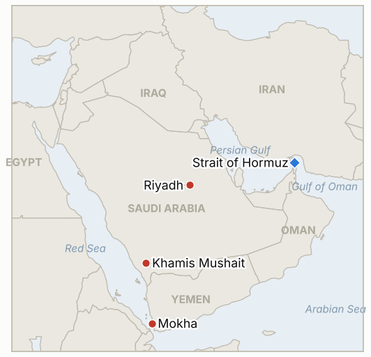

# Middle East Daily Briefing

**October 8, 2026**

- **Reporting window:** ~24 hours, October 7, 06:00 to October 8, 06:00 KST
- **Overall assessment:** The Houthi campaign against Saudi Arabia continued with a ballistic missile aimed at Riyadh's King Khalid airport that the coalition says it intercepted, while Riyadh's energy minister said the East-West pipeline is carrying 5.8 million barrels a day (§1.1). Yemen's ground war stayed contested, with roughly 270 dead in a day and no independent verification of who holds Mokha or Dhubab (§1.2). Iran dismissed pressure over Hormuz while saying it is reviewing a US reply (§1.3). KOSPI fell 1.98% on 3.1 trillion won of foreign selling with Brent near $101 intraday (§1.4). Coverage of the window is thin: several items below were first reported late on October 6 US time and are carried here because they define the state of play.

---

## 1. What Happened

<figure style="float:right; width:46%; margin:2pt 0 8pt 14pt;">

<figcaption style="font-size:8pt; color:#666; text-align:center; margin-top:3pt; font-style:italic;">Major places of discussion</figcaption>
</figure>

### 1.1 Houthis fire at Riyadh's airport as Saudi Arabia stresses pipeline flows

The Houthis said they fired a ballistic missile at King Khalid International Airport in Riyadh, saying air traffic was disrupted, and the coalition said it intercepted a missile north of the capital ([CBS live](https://www.cbsnews.com/live-updates/iran-war-trump-us-oil-prices-yemen-red-sea-houthis-bab-el-mandeb/)). Saudi Energy Minister Prince Abdulaziz bin Salman said East-West pipeline flows had rebounded to 5.8 million barrels a day, countering reports of another shutdown, while Saudi authorities had earlier confirmed attacks on two southern airports ([OilPrice](https://oilprice.com/Latest-Energy-News/World-News/Brent-Back-Above-100-as-Houthis-Hit-Saudi-Infrastructure.html)). The coalition also said it destroyed a missile aimed at Khamis Mushait. **Confidence: High that a launch toward Riyadh was claimed and an interception reported; Low on any disruption to air traffic (Houthi claim only); High on the minister's 5.8 mb/d statement as an official claim, Medium as a physical measurement.**

### 1.2 Yemen's ground war: about 270 dead in a day, territorial claims unverified

AFP, citing sources on both sides, reported more than 270 killed in 24 hours (115 government troops by government sources, 160 fighters by Houthi sources), and fighting continued around Dhubab ([CBS live](https://www.cbsnews.com/live-updates/iran-war-trump-us-oil-prices-yemen-red-sea-houthis-bab-el-mandeb/)). Yemeni forces say they drove the Houthis from areas around Mokha and Bab al-Mandab; the Houthis say they hold "all their gains," and CBS noted neither side's claims could be independently verified. Turkey and Pakistan agreed on a "rapid deployment" of troops to Saudi Arabia under a new mutual defense alliance, and UN Secretary General Guterres condemned the Houthi cross border attacks. **Confidence: Medium on casualty totals (both sides' sources via AFP); Low on control of Mokha and Dhubab.**

### 1.3 Iran refuses to open Hormuz under pressure while tanker attacks continue

Iranian security chief Mohsen Rezaei said "Hormuz will not be opened by threats or pressure," while deputy foreign minister Gharibabadi said Tehran was reviewing a US response to its Hormuz conditions and President Pezeshkian called negotiations "meaningless" after renewed US attacks ([CBS live](https://www.cbsnews.com/live-updates/iran-war-trump-us-oil-prices-yemen-red-sea-houthis-bab-el-mandeb/)). UKMTO reported another tanker struck while leaving the strait, and India said 12 crew, 11 of them Indian, were wounded on the Panama flagged On Peace; CENTCOM said US forces had disabled three ships and redirected 130 since July 14 and denied an Iranian claim of a downed US helicopter. No disclosed content of the US reply surfaced. **Confidence: High on the statements as made; Medium on tanker incident details (UKMTO); Low on Iranian military claims.**

### 1.4 KOSPI falls 1.98% on foreign selling; Brent near $101 intraday

KOSPI closed at 6,803.90, down 137.49 points (1.98%), with foreigners net selling 3.11 trillion won and institutions 860 billion won; KOSDAQ lost 2.34% to 898.43 and the won closed at 1,340.4 per dollar ([Newspim](https://newspim.com/news/view/20261007001012); [Financial News](https://www.fnnews.com/news/202610071552318501)). A Daishin Securities analyst tied the weakness to international oil prices and higher US Treasury yields, and investors waited for Samsung Electronics' third quarter preliminary results on October 8. Brent traded near $101.5 intraday after dipping below $100 the day before, with ING calling it a tug of war between recovering Gulf supply (Vitol: about 12 million barrels of crude a day leaving the Gulf) and Houthi threats; supertanker rates above $1 million a day ([OilPrice](https://oilprice.com/Latest-Energy-News/World-News/Brent-Back-Above-100-as-Houthis-Hit-Saudi-Infrastructure.html)). **Confidence: High on KOSPI and KOSDAQ; Medium on the won; Medium on Brent (intraday only, no settle found).**

---

## 2. Deep Dive: Incentives and Motives

### 2.1 Why does the Houthi campaign keep aiming at Riyadh's airport if it keeps getting intercepted?

Because the political signal does not require a hit. A launch at the capital's main airport forces airlines and embassies (the UK and US told nationals to follow Saudi instructions) to price in risk, and the Houthi warning that Saudi airspace will be "a theater for operations" shifts the cost to civil aviation without touching the oil exports that would invite a harsher response. Interception also lets Riyadh claim defensive success, so both sides gain from the pattern staying below the export threshold.

### 2.2 Why does Riyadh publicize pipeline flows of 5.8 million barrels a day now?

Because the market's main fear is a Saudi export outage, and the minister's statement is aimed at buyers and at the oil price as much as at Houthi commanders. Aramco's Asia discount and the figure together tell refiners that supply is available, which protects Saudi market share and limits the price spike that would feed Washington's pressure on the kingdom to end the Yemen war.

### 2.3 Why does Tehran call talks meaningless while saying it reviews a US reply?

Because Iran runs two tracks: public hardline statements by Rezaei and Pezeshkian protect domestic credibility and keep Hormuz leverage, while the foreign ministry keeps a channel through Qatar open for sanctions relief and an end to the blockade. The split, visible since September, lets Tehran accept a deal without appearing to bend to threats.

---

## 3. Policy Implications for South Korea

**Exposure snapshot:** South Korea draws about 70.7% of its crude and 20.4% of its LNG from the Middle East ([KITA](https://www.kita.net/board/totalTradeNews/totalNewsExistDetail.do?no=99558); `instructions/korea-exposure.md`, no update needed). KOSPI's 6,803.90 close compares with 6,941.39 on October 6 and 7,003.74 on October 2, a drop of about 2.9% in three sessions; the won at 1,340.4 is stronger than the 1,343.6 prior close, so the equity fall was not a currency panic. Foreign net selling of 3.11 trillion won in one session is the largest single day figure in this week's coverage.

**Implications by development:**

- **Riyadh airport launch (§1.1):** Korean crude from Saudi Arabia loads mostly at Gulf and Red Sea terminals, not at the airport; the relevant risk is a strike on Yanbu or Rabigh (IND-20261006-1). A pipeline running at 5.8 mb/d supports the Red Sea alternative Korean refiners rely on.
- **Yemen (§1.2):** control of Mokha and the Bab al-Mandab coast bears on Red Sea routing; unverified claims do not change planning (IND-20261007-1).
- **Hormuz (§1.3):** Indian crew casualties raise the political cost of Korea's pending Hormuz deployment decision (IND-20260928-2); no Korean government statement was found in the window.
- **Markets (§1.4):** the drop was foreign driven and tied to chip names and oil and US yields; Samsung's October 8 preliminary results are the near term catalyst, so a rebound or further fall on that data should not be read as a Middle East signal alone (IND-20261001-2).

**Testable indicators:**

- **IND-20261008-1** (open, new): Brent front month (December) settles above $105 at least once by ~2026-10-16, which would show the Houthi campaign overriding the recovery in Gulf supply; no settle above $105 by then falsifies.
- **IND-20261008-2** (open, new): KOSPI recovers above 7,000 at a daily close by ~2026-10-16; no close above 7,000 by then falsifies.
- **IND-20260930-1** (resolved, falsified): no disclosed US response on Hormuz and nuclear sequencing by the October 7 deadline, although Iran says it is reviewing a US reply.
- **IND-20261006-1** (open): no Saudi confirmation of Riyadh or Rabigh damage; deadline ~2026-10-13.
- **IND-20261006-2** (open): no confirmed Brent settle below $100 yet; the Oct 7 settle was not found; deadline ~2026-10-16.
- **IND-20261001-2** (open): foreign selling persisted on Oct 7 (3.11 trillion won), trending to falsification at the ~2026-10-09 deadline.
- **IND-20261007-1**, **IND-20261007-2**, **IND-20261005-1**, **IND-20261004-1**, **IND-20261003-2**, **IND-20261004-2**, **IND-20261002-2**, **IND-20261002-1**, **IND-20261001-1**, **IND-20260927-3**, **IND-20260929-1**, **IND-20260930-2**, **IND-20260928-1**, **IND-20260928-2**, **IND-20260928-3**, **IND-20260714-4** (open): no resolving information in the window.

---

## 4. Watch List

- **Samsung Electronics' third quarter preliminary results (October 8) and KOSPI foreign flows (IND-20261001-2, IND-20261008-2).**
- **Any Saudi or Aramco statement on Rabigh, Riyadh airport or Khurais (IND-20261006-1, IND-20261005-1, IND-20261004-1).**
- **Contents of the US reply Iran says it is reviewing, and any Qatar relayed counterproposal (IND-20261001-1).**
- **Arrival of the Theodore Roosevelt group and Makin Island group (IND-20261004-2).**
- **Independent confirmation of Mokha and Dhubab control (IND-20261007-1).**
- **October tally of Hormuz tanker attacks (IND-20261007-2).**

---

## 5. Source Quality Summary

| Claim | Sources | Confidence |
| --- | --- | --- |
| Houthi missile at Riyadh airport, coalition interception | CBS live (AFP, Houthi statements) | Medium |
| East-West pipeline 5.8 mb/d | OilPrice citing Saudi energy minister | Medium |
| Roughly 270 killed in Yemen in 24 hours | CBS live citing AFP | Medium |
| Mokha and Dhubab control | CBS live, partisan claims | Low |
| Iranian statements on Hormuz and US reply | CBS live (IRNA, AFP) | High as statements |
| Tanker attacks, On Peace crew wounded | CBS live (UKMTO, India MFA) | High |
| KOSPI 6,803.90, KOSDAQ 898.43, foreign sale 3.11 trillion won | Newspim, Financial News | High |
| Won 1,340.4 | Newspim | Medium |
| Brent about $101.5 and WTI about $90.1 intraday | OilPrice | Medium, no settle found |
