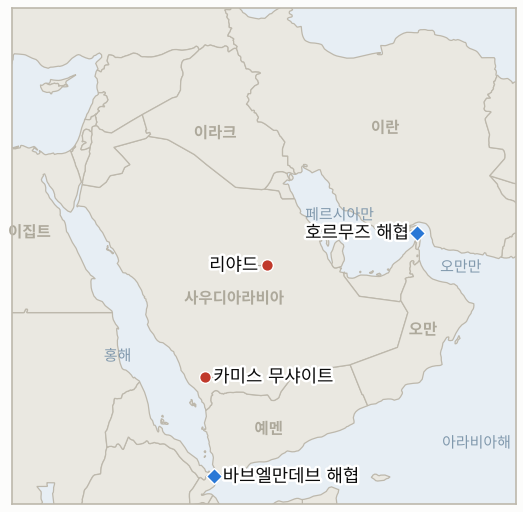
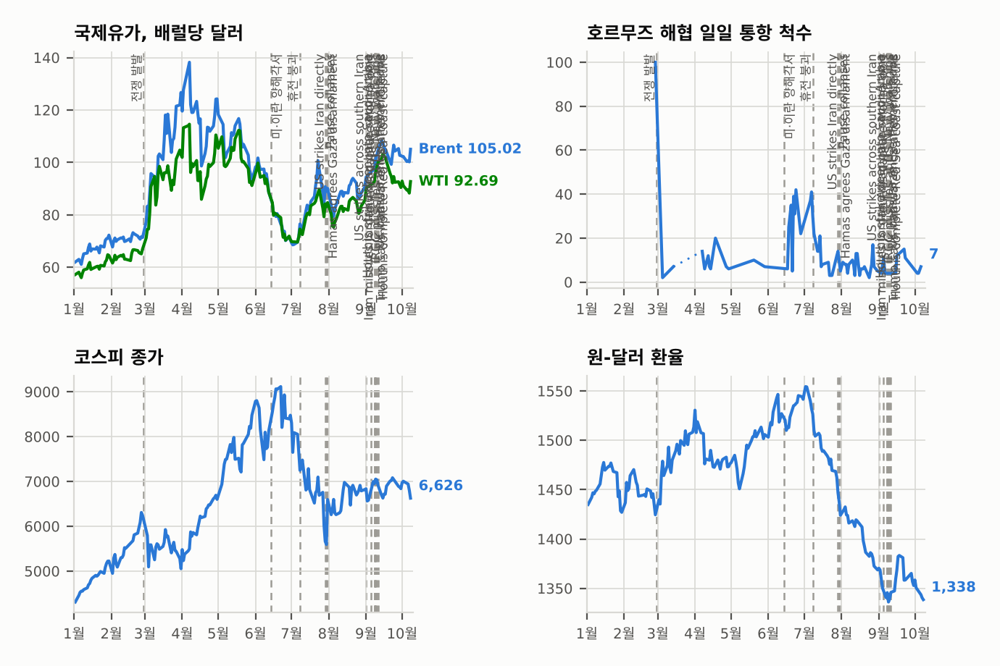

# 중동 일일 브리핑

**2026년 10월 9일**

- **보고 기간:** 약 24시간, 10월 8일 06:00 ~ 10월 9일 06:00 (한국시간)
- **종합 평가:** 호르무즈 일대 유조선 공격이 사상 최대 속도로 이어지고 미국 멕시코만 허리케인으로 생산이 중단되면서 국제유가가 장중 약 5% 올라 배럴당 105달러를 넘었다(§1.1, §1.2). 트럼프 대통령은 11월 3일 중간선거 전에는 이란을 다시 공격하지 않겠다며 대화가 "생산적"이라고 말했고, 악시오스는 국방부가 대규모 작전 선택지를 준비하고 있다고 보도했다(§1.3). 후티의 리야드·카미스 무샤이트 미사일 공세는 계속되어 연합군이 3발을 요격했다고 밝혔으며, 바브엘만데브 일대 고지 장악을 두고 양측 주장은 여전히 엇갈린다(§1.4). 삼성전자가 사상 처음 분기 영업이익 100조 원을 넘겼지만 코스피는 외국인 매도로 2.62% 내린 6,625.93에 마감했다(§1.5). 이번 보고 기간은 자료가 얇다. 여러 통신 기사가 종가 없이 장중 가격만 전했고, 목요일 알자지라 라이브 페이지도 주요 항목 외에는 세부 내용이 적었다.

---

## 1. 무슨 일이 있었나

<figure style="float:right; width:46%; margin:2pt 0 8pt 14pt;">

<figcaption style="font-size:8pt; color:#666; text-align:center; margin-top:3pt; font-style:italic;">주요 논의 지점</figcaption>
</figure>

### 1.1 호르무즈 공격과 멕시코만 허리케인이 겹치며 유가가 약 5% 급등한다

목요일 브렌트유는 장중 약 5% 올라 배럴당 105달러를 넘었고 WTI도 비슷하게 올랐으나 고점에서 다소 내려왔다. 이날 종가는 찾지 못했다([OilPrice](https://oilprice.com/Latest-Energy-News/World-News/Oil-Jumps-2-as-Iran-Steps-Up-Attacks-on-Hormuz-Tankers.html), [OGJ](https://www.ogj.com/general-interest/economics-markets/news/55410621/oil-jumps-5-as-hormuz-tanker-attacks-escalate-us-gulf-hurricane-shuts-in-production)). 브렌트유는 수요일 38센트 내린 100.20달러에 마감했는데, 국제에너지기구(IEA)가 기존 비상비축유 방출 인도를 앞당기고 경유를 우선하기로 한 영향이었다. IEA는 이번 가속이 총 방출 약정량을 늘리는 것은 아니며 약 1억 배럴이 남아 있다고 밝혔다([알자지라](https://www.aljazeera.com/amp/news/liveblog/2026/10/7/iran-war-live-yemen-forces-claim-control-over-strategic-taiz-mountain-peak), [OGJ](https://www.ogj.com/general-interest/economics-markets/news/55410621/oil-jumps-5-as-hormuz-tanker-attacks-escalate-us-gulf-hurricane-shuts-in-production)). 금요일 밤에서 토요일 새벽 사이 미국 북부 멕시코만 연안에 상륙할 것으로 예상되는 허리케인 아이사이아스로 10월 7일 기준 하루 약 51만 1,619배럴(25.1%)의 해상 생산이 중단되었고, 셸과 셰브런은 시설에서 인력을 철수시켰다. **신뢰도: 수요일 종가는 높음, 목요일 고점은 중간(장중 수치이며 포착 시점에 따라 매체별로 몇 달러씩 다르다), 생산 중단 수치는 중간(기사가 출처 기관 명칭을 잘못 적었다).**

### 1.2 호르무즈 유조선 피격이 사상 최대를 기록하고 통항은 줄어든다

케이플러는 9월 28일부터 10월 4일까지 해협에서 유조선 10척이 피격되었다고 집계했다. 이전 주간 최고치 6척을 넘는 수치다. 화요일 통항 유조선은 7척에 그쳐 7월 23일 이후 최저였고 7일 평균의 절반에도 못 미쳤다([OilPrice](https://oilprice.com/Latest-Energy-News/World-News/Oil-Jumps-2-as-Iran-Steps-Up-Attacks-on-Hormuz-Tankers.html), [Yahoo Finance](https://finance.yahoo.com/energy/articles/oil-prices-jump-middle-east-095219966.html)). 영국해상무역기구(UKMTO)는 수요일 유조선 한 척이 "다수의 발사체"에 맞아 사상자가 났다고 전했다. OGJ는 파이낸셜타임스를 인용해, 9월 말 개전 전의 90% 가까이 회복되었던 물동량이 카타르·오만·해협 인근 공격이 거세지면서 10월 6일 하루 약 400만 배럴로 다시 떨어졌다고 전했다. 한 보도는 9월 28일부터 10월 2일까지 공격이 12건이라고 집계해 케이플러와 기간이 달라 총계를 곧바로 비교할 수 없다. **신뢰도: 공격과 통항 부진이 이어졌다는 점은 높음(UKMTO, 케이플러), 공격 건수는 중간(기간과 출처에 따라 다르다).**

### 1.3 트럼프가 중간선거 전 이란 추가 공격은 없다고 밝히고 악시오스는 국방부 준비를 보도한다

트럼프 대통령은 목요일 미국이 이란과 "생산적인 논의"를 하고 있으며 11월 3일 중간선거 전에는 이란을 다시 공격하지 않겠다고 말했다([알자지라](https://www.aljazeera.com/news/liveblog/2026/10/8/yemen-war-live-yemeni-forces-claim-key-heights-as-houthi-attacks-go-on)). 같은 날 CNN 계열 보도는 악시오스를 인용해 국방부가 이란에 대한 대규모 작전 가능성에 대비한 준비를 지시했다고 전했다. 이는 선거 뒤에 확전을 검토할 것으로 보고 있다는 로이터의 앞선 보도와 맞아떨어지나, 이번 브리핑은 악시오스 원문을 확인하지 못했다. 이란의 반응은 찾지 못했고, 이란 대통령은 전날 미국의 재공격 뒤 협상이 "무의미"하다고 말한 바 있어 이번 약속은 최근 행보와 어긋나 보인다. **신뢰도: 트럼프 발언 자체는 높음, 악시오스 보도는 낮음(재인용), 약속의 구속력은 낮음.**

### 1.4 후티가 리야드와 카미스 무샤이트에 미사일을 쏘고 바브엘만데브 해안 주장은 엇갈린다

연합군 대변인 투르키 알말리키 대령은 리야드를 겨냥한 후티 탄도미사일 2발과 카미스 무샤이트를 겨냥한 1발을 요격해 파괴했다고 밝혔다([알자지라](https://www.aljazeera.com/news/liveblog/2026/10/8/yemen-war-live-yemeni-forces-claim-key-heights-as-houthi-attacks-go-on)). 알자지라는 10월 7일 공항 공격으로 외국인 3명이 숨졌다는 사우디 발표도 연결해 전했으나, CBS는 3명이 경상을 입었을 뿐이라고 보도해 인명 피해 기록은 정리되지 않았다. 예멘 정부군은 바브엘만데브 해협을 내려다보는 카흐부브 산악 지대를 완전히 장악했다고 밝혔고, 후티는 해안 일대를 "완전히 통제"하고 있다고 맞섰다. **신뢰도: 연합군이 요격을 발표했다는 점은 높음, 공항 인명 피해는 낮음(출처 간 상충), 고지 통제권은 낮음(당사자 주장).**

### 1.5 삼성전자 사상 최대 실적에도 코스피가 2.62% 하락한다

코스피는 177.97포인트(2.62%) 내린 6,625.93에 마감했다. 삼성전자의 3분기 잠정실적은 매출 195조 원, 영업이익 107조 4천억 원으로 사상 처음 분기 영업이익 100조 원을 넘겼고 시장 전망치 106조 6천억 원도 웃돌았다([뉴스핌](https://www.newspim.com/news/view/20261008000948), [머니투데이](https://www.mt.co.kr/stock/2026/10/08/2026100809271937732)). 외국인은 정규장 코스피에서 1조 9,889억 원(대체거래소 포함 2조 4,406억 원), 기관은 1조 6,657억 원을 순매도했고 개인은 약 3조 7천억 원을 순매수했다. 삼성전자는 2.42% 내린 26만 2,000원에 마감했고 코스닥은 0.69% 내린 892.27이었다. 원화는 달러당 1,338.5원으로 1.9원 올랐다. 키움증권 연구원은 메모리 증설이 이뤄지는 2027~2028년 이후에도 높은 마진이 이어질지에 대한 의구심과 미국 금리 상승을 신중론의 배경으로 짚었다. 10월 9일 금요일은 한글날로 국내 증시가 휴장한다. **신뢰도: 코스피·삼성전자·수급은 높음, 원화는 중간(단일 출처).**

---

## 2. 심층 분석: 동기와 유인

### 2.1 트럼프는 왜 중간선거 전 이란 추가 공격은 없다고 하면서 국방부에는 대규모 작전을 준비시키는가?

두 메시지의 청중이 다르기 때문이다. 공개적인 자제 약속은 선거 전 유가 급등의 정치적 위험을 낮춘다. 로이터에 따르면 전쟁 지지율은 31%에 그치고 휘발유 가격은 유권자의 관심사다. 작전 준비 지시는 테헤란에 위협의 신뢰성을 유지하고, 로이터가 보도한 대로 보좌진이 11월 3일 이후 검토할 것으로 보는 선택지를 마련해 둔다. 약속의 대가는 이란이 그 기간을 호르무즈 압박을 더 조이는 시간으로 읽을 수 있다는 점이며, 사상 최대의 유조선 공격 기록과 맞아떨어진다.

### 2.2 걸프 수출이 회복되던 바로 그때 왜 유조선 공격이 거세지는가?

회복은 이란의 협상력을 깎기 때문이다. 9월 말 개전 전 90% 가까이 회복된 물동량은 이란이 양보하지 않고도 해협이 사실상 다시 열렸다는 뜻이 되었을 것이다. 보험료와 선원 위험을 끌어올리는 공격은 공식적 봉쇄 없이도 통항을 다시 낮추고, 이란은 이를 부인하거나 타국 소행으로 돌릴 수 있다. 대체 항로가 없는 산유국들이 선박 손상 위험을 감수한다는 ANZ의 관찰은 반대쪽으로도 작용한다. 공격이 항해 비용을 높이긴 해도 항해 자체를 멈추지 못할 수 있고, 이것이 공격이 계속 거세지는 이유를 설명해 준다.

### 2.3 요격이 일상인데도 후티는 왜 리야드와 카미스 무샤이트를 계속 겨냥하는가?

이번 주 초와 같은 신호 효과 때문이다. 발사만으로 항공사, 보험사, 사우디 방공망이 수도와 남부를 위험 지역으로 취급하게 되고, 더 강한 보복을 부를 석유 시설 피해는 피할 수 있다. 요격 발표는 리야드에도 이롭다. 튀르키예와 파키스탄의 새 약속까지 더해진 방어가 작동한다는 점을 보여줄 수 있기 때문이다. 전략적으로는 바브엘만데브 고지를 둘러싼 상반된 주장이 더 중요하다. 해안 통제권이 홍해 항로와 얀부 송유 경로를 누가 위협할 수 있는지를 결정하기 때문이다.

---

## 3. 한국에 대한 정책적 시사점

**노출도 요약:** 한국은 원유의 약 70.7%, LNG의 약 20.4%를 중동에서 들여온다(`instructions/korea-exposure.md`, 갱신 불필요). 코스피 종가 6,625.93은 10월 7일 6,803.90, 10월 2일 7,003.74와 비교해 세 거래일 사이 약 5.4% 하락한 수준이다. 원화는 1,338.5원으로 1,340.4원보다 소폭 강해, 이번에도 주가 하락은 환율 문제가 아니다. 삼성전자의 107조 4천억 원 분기 실적은 이익 기반이 문제가 아님을 보여준다. 문제는 외국인 매도이며, 장중 집계 한 곳은 이를 9거래일 연속이라고 전한다.

**전개별 시사점:**

- **유가(§1.1):** 브렌트유가 105달러 위로 돌아오면 9월 말 이후 원장이 추적해 온 105달러 아래 구간이 시험대에 오른다(IND-20261008-1). 정부·민간 비축 약 206일분은 시간을 벌어주지만, IEA를 거치지 않은 단독 방출은 어려울 것이다.
- **호르무즈(§1.2):** 유조선 통항 감소는 한국의 걸프 원유 선적에 직접 타격이다. 계류 중인 호르무즈 파병 문제(IND-20260928-2)에 대한 정부 입장은 보고 기간에 찾지 못했다. 인도 선원 사상과 공격 속도 기록이 결정의 정치적 비용을 높인다.
- **미·이란(§1.3):** 11월 3일까지 미국의 자제 약속은 앞으로 3주 반의 확전 위험을 줄이지만 선거 이후의 꼬리 위험을 키운다. 서울의 비상계획은 이 기간이 닫힐 수 있다는 가정을 해야 한다(IND-20261009-1).
- **시장(§1.5):** 삼성 실적 발표로 단기 이익 재료는 소멸했다. 다음 시험대는 10월 12일 월요일 개장 때 외국인이 돌아오는지다(IND-20261009-3).

**검증 가능한 지표:**

- **IND-20261009-1** (신규, 진행 중): ~2026-10-23까지 이란 영토나 병력에 대한 미국의 공격이 공개되지 않으면 트럼프의 자제 약속이 유지되는 것이며, 공개된 공격이 있으면 반증된다.
- **IND-20261009-2** (신규, 진행 중): ~2026-10-16까지 케이플러나 UKMTO가 하루 호르무즈 유조선 통항 15척 이상을 보고하면 공격에도 회복되는 것이고, 없으면 반증된다.
- **IND-20261009-3** (신규, 진행 중): ~2026-10-16까지 외국인이 정규장 코스피에서 하루라도 순매수하면 매도 행진이 끝난 것이고, 없으면 반증된다.
- **IND-20260925-2** (해소, 반증): 10월 8일 기한까지 이란이 인도양 쪽으로 작전 조치를 취했다는 공개 보도가 없었다.
- **IND-20261001-2** (해소, 반증): 외국인이 10월 7일(3조 1,100억 원)과 10월 8일(1조 9,889억 원) 순매도했고 10월 9일 기한까지 순매수 한 주가 없었다.
- **IND-20261002-2** (해소, 반증): 10월 9일 기한까지 오만 앞바다 초대형 유조선 피격에 대한 정부나 UKMTO의 소행 지목이 없었다.
- **IND-20261008-1** (진행 중): 목요일 브렌트유 고점 약 105.02달러는 장중 수치에 그치고 종가는 찾지 못해 판정은 보류다(기한 ~2026-10-16).
- **IND-20261006-2** (진행 중): 10월 7일 브렌트유 종가 100.20달러로 100달러 아래가 아니었다. 기한 ~2026-10-16.
- **IND-20261008-2** (진행 중): 코스피 종가 6,625.93으로 7,000에서 더 멀어졌다.
- **IND-20261006-1**, **IND-20261005-1**, **IND-20261004-1**, **IND-20261007-1**, **IND-20261007-2**, **IND-20261004-2**, **IND-20261003-2**, **IND-20261002-1**, **IND-20261001-1**, **IND-20260927-3**, **IND-20260929-1**, **IND-20260930-2**, **IND-20260928-1**, **IND-20260928-2**, **IND-20260928-3**, **IND-20260714-4** (진행 중): 보고 기간에 판정할 정보 없음.

---

## 4. 주시 목록

- **금요일 밤~토요일 미국 멕시코만 연안 허리케인 아이사이아스 상륙과 10월 9일 금요일 브렌트유 종가(IND-20261008-1, IND-20261006-2).**
- **트럼프의 약속과 악시오스가 전한 국방부 준비에 대한 이란의 반응(IND-20261009-1).**
- **케이플러 유조선 통항 집계와 10월 호르무즈 공격 누계(IND-20261009-2, IND-20261007-2).**
- **10월 12일 월요일 개장 때 코스피 외국인 수급(IND-20261009-3, IND-20261008-2).**
- **라비그 정유시설, 리야드 공항, 쿠라이스에 관한 사우디·아람코 발표(IND-20261006-1, IND-20261005-1, IND-20261004-1).**
- **카흐부브 고지와 모카 통제권의 독립적 확인(IND-20261007-1).**

---

## 5. 출처 품질 요약

| 주장 | 출처 | 신뢰도 |
| --- | --- | --- |
| 10월 8일 브렌트유 장중 105달러 이상, 종가는 찾지 못함 | OilPrice, OGJ | 중간 |
| 10월 7일 브렌트유 100.20달러·WTI 88.28달러 종가 | 알자지라, CNBC(검색 요약) | 높음 |
| 아이사이아스로 멕시코만 원유 생산 25.1% 중단 | OGJ(출처 기관명 오기) | 중간 |
| 유조선 피격 최다(9/28~10/4 10척), 10월 6일 유조선 통항 7척 | 케이플러(OilPrice, Yahoo Finance 재인용) | 높음 |
| 물동량 개전 전의 90% 근접 후 10월 6일 약 400만 b/d | OGJ(파이낸셜타임스 인용) | 중간 |
| 트럼프: 11월 3일 전 이란 추가 공격 없음 | 알자지라 | 발언으로는 높음 |
| 국방부의 대규모 작전 준비 지시 | OGJ/CNN 요약(악시오스 인용, 원문 미확인) | 낮음 |
| 후티 미사일 3발 요격(리야드, 카미스 무샤이트) | 알자지라(연합군 대변인) | 중간 |
| 공항 공격 사망 대 경상 | 알자지라, CBS(상충) | 낮음 |
| 카흐부브 고지 통제권 | 알자지라, 당사자 주장 | 낮음 |
| 코스피 6,625.93, 삼성전자 3분기 잠정 영업이익 107.4조 원, 수급 | 뉴스핌, 머니투데이 | 높음 |
| 원화 1,338.5 | 뉴스핌(검색 요약) | 중간 |
