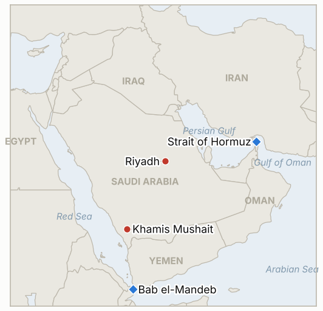

# Middle East Daily Briefing

**October 9, 2026**

- **Reporting window:** ~24 hours, October 8, 06:00 to October 9, 06:00 KST
- **Overall assessment:** Oil jumped roughly 5% intraday to above $105 a barrel as tanker attacks around Hormuz hit a record pace and a Gulf of Mexico hurricane shut in US output (§1.1, §1.2). President Trump said Washington will not attack Iran again before the November 3 midterms and that talks are "productive," while Axios reported the Pentagon is preparing options for large operations (§1.3). The Houthi missile campaign against Riyadh and Khamis Mushait continued, with the coalition reporting three interceptions, and the two sides still dispute who holds the Bab al-Mandab heights (§1.4). KOSPI fell 2.62% to 6,625.93 on foreign selling even as Samsung Electronics posted the first quarterly operating profit above 100 trillion won (§1.5). Coverage of the window is thin: several wire pieces gave only intraday prices and no settles, and Thursday's Al Jazeera live page carried few details beyond the headline items.

---

## 1. What Happened

<figure style="float:right; width:46%; margin:2pt 0 8pt 14pt;">

<figcaption style="font-size:8pt; color:#666; text-align:center; margin-top:3pt; font-style:italic;">Major places of discussion</figcaption>
</figure>

### 1.1 Oil jumps about 5% as Hormuz attacks and a Gulf hurricane collide

Brent rose about 5% intraday on Thursday to above $105 a barrel, with WTI up a similar amount, before easing from the highs; no settlement price was found for the day ([OilPrice](https://oilprice.com/Latest-Energy-News/World-News/Oil-Jumps-2-as-Iran-Steps-Up-Attacks-on-Hormuz-Tankers.html); [OGJ](https://www.ogj.com/general-interest/economics-markets/news/55410621/oil-jumps-5-as-hormuz-tanker-attacks-escalate-us-gulf-hurricane-shuts-in-production)). Brent had settled at $100.20 on Wednesday, down 38 cents, after the IEA agreed to speed deliveries under its existing emergency release and prioritize diesel; the IEA said the acceleration does not raise the total pledged, and about 100 million barrels remain available ([Al Jazeera](https://www.aljazeera.com/amp/news/liveblog/2026/10/7/iran-war-live-yemen-forces-claim-control-over-strategic-taiz-mountain-peak); [OGJ](https://www.ogj.com/general-interest/economics-markets/news/55410621/oil-jumps-5-as-hormuz-tanker-attacks-escalate-us-gulf-hurricane-shuts-in-production)). Hurricane Isaias, forecast to reach the northern Gulf Coast late Friday or early Saturday, had shut in an estimated 511,619 barrels a day of offshore output (25.1%) as of October 7, with Shell and Chevron evacuating platforms. **Confidence: High on Wednesday's settle; Medium on the Thursday highs (intraday, outlets differ by a few dollars depending on the time captured); Medium on the shut-in figure (the article misnames its source agency).**

### 1.2 Hormuz tanker strikes hit a record while traffic thins

Kpler counted 10 tankers struck in the strait between September 28 and October 4, above the previous weekly high of six, and only seven tankers transited on Tuesday, the fewest since July 23 and under half the seven day average ([OilPrice](https://oilprice.com/Latest-Energy-News/World-News/Oil-Jumps-2-as-Iran-Steps-Up-Attacks-on-Hormuz-Tankers.html); [Yahoo Finance](https://finance.yahoo.com/energy/articles/oil-prices-jump-middle-east-095219966.html)). UKMTO reported another tanker hit by "multiple projectiles" with casualties on Wednesday, and OGJ, citing the Financial Times, said flows that had recovered to nearly 90% of prewar levels in late September fell back to about 4 million barrels a day on October 6 as attacks near Qatar, Oman and the strait intensified. One account counts a dozen attacks between September 28 and October 2, a different window from Kpler's, so the totals are not directly comparable. **Confidence: High that attacks and thin traffic continued (UKMTO, Kpler); Medium on exact attack counts, which vary by window and source.**

### 1.3 Trump pledges no new Iran attack before the midterms; Axios reports Pentagon preparations

Trump said Thursday the United States is having "productive discussions" with Iran and will not launch another attack on it before the November 3 midterm elections ([Al Jazeera](https://www.aljazeera.com/news/liveblog/2026/10/8/yemen-war-live-yemeni-forces-claim-key-heights-as-houthi-attacks-go-on)). The same day, CNN-syndicated reporting cited Axios saying the Pentagon had ordered preparations for potential large-scale operations against Iran, which would fit earlier Reuters reporting that aides expect escalation to be considered after the vote; this briefing could not retrieve the Axios piece itself. No Iranian reaction was found, and Iran's president called talks "meaningless" a day earlier after renewed US attacks, so the pledge sits uneasily with the recent record. **Confidence: High that Trump made the statement; Low on the Axios report (second hand); Low on the pledge being binding.**

### 1.4 Houthi missiles at Riyadh and Khamis Mushait; contested claims on the Bab al-Mandab coast

Coalition spokesman Col. Turki al-Maliki said forces intercepted and destroyed two Houthi ballistic missiles aimed at Riyadh and one at Khamis Mushait ([Al Jazeera](https://www.aljazeera.com/news/liveblog/2026/10/8/yemen-war-live-yemeni-forces-claim-key-heights-as-houthi-attacks-go-on)). Al Jazeera also linked a Saudi statement that three foreign nationals were killed in the October 7 airport attacks, while CBS reported only minor injuries to three people, so the casualty record is unsettled. Yemeni government forces said they took full control of the Kahboub mountains overlooking the Bab al-Mandab strait; the Houthis say they hold "full control" of the coast. **Confidence: High that the coalition reported interceptions; Low on airport casualty figures (sources conflict); Low on control of the heights (partisan claims).**

### 1.5 KOSPI falls 2.62% despite Samsung's record profit

KOSPI closed at 6,625.93, down 177.97 points (2.62%), after Samsung Electronics' third quarter preliminary results showed revenue of 195 trillion won and operating profit of 107.4 trillion won, the first quarterly operating profit above 100 trillion won and above the consensus of 106.6 trillion ([Newspim](https://www.newspim.com/news/view/20261008000948); [Money Today](https://www.mt.co.kr/stock/2026/10/08/2026100809271937732)). Foreigners net sold 1.99 trillion won on the regular KOSPI session (2.44 trillion including alternative venues) and institutions 1.67 trillion, while individuals bought about 3.7 trillion; Samsung closed down 2.42% at 262,000 won and KOSDAQ fell 0.69% to 892.27. The won closed at 1,338.5 per dollar, 1.9 won stronger. A Kiwoom Securities analyst tied the caution to doubts that chip margins last beyond 2027 to 2028 as memory capacity expands, plus rising US yields. Korean markets are closed on Friday October 9 for Hangul Day. **Confidence: High on KOSPI, Samsung and flows; Medium on the won (single source).**

---

## 2. Deep Dive: Incentives and Motives

### 2.1 Why would Trump rule out new strikes on Iran before the midterms while the Pentagon plans for large operations?

Because the two statements serve different audiences. A public pledge of restraint lowers the political risk of a pre-election oil spike: only 31% of Americans approve of the war, according to Reuters, and gasoline is a voter issue. Planning orders keep the threat credible for Tehran and prepare options for after November 3, which Reuters reported aides expect to consider. The cost of the pledge is that Iran can read it as a window in which to keep tightening the Hormuz squeeze, which is consistent with the record tanker attacks.

### 2.2 Why is the tanker campaign intensifying just as Gulf exports were recovering?

Because recovery erodes Iran's leverage. Flows near 90% of prewar levels in late September would have meant the strait was effectively reopened without Iranian concessions. Attacks that raise insurance costs and crew risk push traffic back down without a formal closure, which Iran can deny or attribute to others. ANZ's observation that producers are willing to risk damage because they have no alternative route also cuts the other way: Iran's strikes make the cost of each voyage rise but may not stop it, which helps explain why the attacks keep escalating.

### 2.3 Why do the Houthis keep launching at Riyadh and Khamis Mushait when interception is the norm?

For the same signaling reason as earlier this week: launches force airlines, insurers and Saudi air defense to treat the capital and the south as exposed without producing the oil damage that would invite a harsher response. The interception claims also suit Riyadh, which wants to show that its defenses, now backed by new Turkish and Pakistani commitments, work. The competing claims on the Bab al-Mandab heights matter more strategically, because control of the coast determines who can threaten Red Sea shipping and the Yanbu route.

---

## 3. Policy Implications for South Korea

**Exposure snapshot:** South Korea draws about 70.7% of its crude and 20.4% of its LNG from the Middle East (`instructions/korea-exposure.md`, no update needed). KOSPI's 6,625.93 close compares with 6,803.90 on October 7 and 7,003.74 on October 2, a fall of about 5.4% in three sessions; the won at 1,338.5 is slightly stronger than 1,340.4, so the equity decline is again not a currency event. Samsung's 107.4 trillion won quarter shows that the earnings backdrop is not the problem; foreign selling is, and it is now a nine session streak by one intraday count.

**Implications by development:**

- **Oil (§1.1):** a Brent move back above $105 would test the sub-$105 range the ledger has tracked since late September (IND-20261008-1). Korea's stock cover of about 206 days (government and private) gives time, but a release other than through the IEA is unlikely.
- **Hormuz (§1.2):** falling tanker transits hit Korea's Gulf crude loadings directly. No Korean government statement on the pending Hormuz deployment (IND-20260928-2) was found in the window; Indian crew casualties and the record attack pace raise the political cost of a decision.
- **US-Iran (§1.3):** a US pledge of restraint until November 3 narrows the escalation risk to the next three and a half weeks but raises the post-election tail; Seoul's contingency planning should assume the window may close (IND-20261009-1).
- **Markets (§1.5):** the Samsung result removed the near term earnings catalyst; the next test is whether foreigners return when the market reopens on Monday, October 12 (IND-20261009-3).

**Testable indicators:**

- **IND-20261009-1** (open, new): no disclosed US strike on Iranian territory or forces by ~2026-10-23, which would show Trump's restraint pledge holding; a disclosed US strike by then falsifies.
- **IND-20261009-2** (open, new): Kpler or UKMTO reports Hormuz tanker transits of 15 or more on any day by ~2026-10-16, which would show recovery despite the attacks; none falsifies.
- **IND-20261009-3** (open, new): foreign investors post net buying on the regular KOSPI session on at least one day by ~2026-10-16, ending the selling streak; none falsifies.
- **IND-20260925-2** (resolved, falsified): no disclosed Iranian operational step toward the Indian Ocean by the October 8 deadline.
- **IND-20261001-2** (resolved, falsified): foreigners were net sellers on October 7 (3.11 trillion won) and October 8 (1.99 trillion won); no net buying week to the October 9 deadline.
- **IND-20261002-2** (resolved, falsified): no government or UKMTO attribution of the supertanker strike off Oman by the October 9 deadline.
- **IND-20261008-1** (open): Thursday's Brent high of about $105.02 was intraday only; the settle is not found, so the test is unresolved (deadline ~2026-10-16).
- **IND-20261006-2** (open): Brent settled $100.20 on October 7, not below $100; deadline ~2026-10-16.
- **IND-20261008-2** (open): KOSPI closed at 6,625.93, further below 7,000.
- **IND-20261006-1**, **IND-20261005-1**, **IND-20261004-1**, **IND-20261007-1**, **IND-20261007-2**, **IND-20261004-2**, **IND-20261003-2**, **IND-20261002-1**, **IND-20261001-1**, **IND-20260927-3**, **IND-20260929-1**, **IND-20260930-2**, **IND-20260928-1**, **IND-20260928-2**, **IND-20260928-3**, **IND-20260714-4** (open): no resolving information in the window.

---

## 4. Watch List

- **Hurricane Isaias landfall on the US Gulf Coast (Friday night to Saturday) and the Brent settle on Friday, October 9 (IND-20261008-1, IND-20261006-2).**
- **Any Iranian response to Trump's pledge and the Axios report of Pentagon preparations (IND-20261009-1).**
- **Kpler tanker transit counts and the October tally of Hormuz attacks (IND-20261009-2, IND-20261007-2).**
- **KOSPI foreign flows when Korean markets reopen on Monday, October 12 (IND-20261009-3, IND-20261008-2).**
- **Saudi or Aramco statements on Rabigh, Riyadh airport or Khurais (IND-20261006-1, IND-20261005-1, IND-20261004-1).**
- **Independent confirmation of control of the Kahboub heights and Mokha (IND-20261007-1).**

---

## 5. Source Quality Summary

| Claim | Sources | Confidence |
| --- | --- | --- |
| Brent above $105 intraday Oct 8; no settle found | OilPrice, OGJ | Medium |
| Brent $100.20 and WTI $88.28 settle on Oct 7 | Al Jazeera, CNBC via search summary | High |
| Isaias shut-ins 25.1% of Gulf of Mexico oil output | OGJ (source agency misnamed) | Medium |
| Record tanker strikes (10 in Sept 28 to Oct 4), 7 tanker transits on Oct 6 | Kpler via OilPrice and Yahoo Finance | High |
| Flows near 90% of prewar then about 4 mb/d on Oct 6 | OGJ citing the Financial Times | Medium |
| Trump: no new attack on Iran before Nov 3 | Al Jazeera | High as a statement |
| Pentagon ordered preparations for large operations | OGJ/CNN summary citing Axios; original not retrieved | Low |
| Three Houthi missiles intercepted (Riyadh, Khamis Mushait) | Al Jazeera citing coalition spokesman | Medium |
| Airport attack deaths versus minor injuries | Al Jazeera, CBS (conflict) | Low |
| Kahboub heights control | Al Jazeera, partisan claims | Low |
| KOSPI 6,625.93, Samsung Q3 preliminary profit 107.4tn won, flows | Newspim, Money Today | High |
| Won 1,338.5 | Newspim (via search summary) | Medium |
