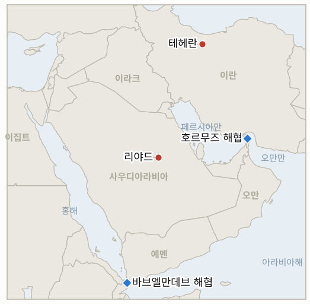

# 중동 일일 브리핑

**2026년 10월 10일**

- **보고 기간:** 약 24시간, 10월 9일 06:00 ~ 10월 10일 06:00 (한국시간)
- **종합 평가:** 11월 3일 중간선거 전 이란을 공격하지 않겠다는 트럼프의 약속은 보고 기간에도 유지됐지만, NYT는 국방부가 이란의 미사일, 드론, 에너지, 혁명수비대 표적을 겨냥한 사흘짜리 작전안을 마련했고 트럼프가 아직 승인하지 않았다고 보도했다. 이란의 페제시키안 대통령은 테헤란이 평화 제안을 수정했다고 밝혔다(§1.1). 이란 혁명수비대는 호르무즈 남쪽 "불법 항로"에서 LPG 운반선 NV 선샤인을 타격했다고 주장했으나 독립적 확인은 없다(§1.2). 브렌트유는 약 103달러로 내렸고 백악관은 공급 쪽 대책을 내놓았다. 러시아가 경유 30만 톤을 방출하고, 재무부가 러시아 에너지 제재를 일부 면제했으며, 독일이 최대 1,500만 배럴을 푼다(§1.3). 후티의 공항 공격으로 사우디인 3명이 숨진 뒤 주요 항공사가 리야드 운항을 중단했다(§1.4). 한국 증시는 한글날로 휴장해 코스피와 원화 종가가 없고, 보고 기간의 보도는 얇다. 브렌트유 종가와 호르무즈 통항 집계는 찾지 못했다.

**정정 및 업데이트:** 10월 9일 브리핑(§1.4)은 공항 사상자 수를 확정하지 못했으나, CBS는 사우디 당국이 리야드 공항 공격으로 사우디인 3명이 숨졌다고 밝혔다고 전해 사우디 발표 쪽으로 정리된다. 10월 9일 브리핑(§1.3)은 악시오스 보도를 재인용해 국방부 준비를 전했는데, NYT는 이제 트럼프가 승인하지 않은 사흘짜리 작전안이 마련됐다고 보도한다. 10월 9일 브리핑은 목요일 브렌트유 고점을 장중 약 105달러로 적었고, 같은 날 WTI 종가는 91.49달러(+3.6%)로 데이터에 소급 반영했다.

---

## 1. 무슨 일이 있었나

<figure style="float:right; width:46%; margin:2pt 0 8pt 14pt;">

<figcaption style="font-size:8pt; color:#666; text-align:center; margin-top:3pt; font-style:italic;">주요 논의 지점</figcaption>
</figure>

### 1.1 자제 약속, 마련된 공격안, 수정된 이란 제안

트럼프는 미국이 11월 3일 중간선거 전에는 "이란을 공격하지 않을 것"이며 해상 봉쇄는 유지된다고 올렸다([CBS News](https://www.cbsnews.com/live-updates/iran-war-trump-us-elections-saudi-arabia-yemen-houthis/)). NYT 보도의 검색 요약에 따르면 국방부는 이란의 미사일·드론 무기고, 에너지 시설, 혁명수비대 거점을 겨냥한 사흘짜리 작전안을 마련했으며 트럼프는 승인하지 않았다. 이 브리핑은 NYT 원문을 열람하지 못했다. 페제시키안은 이란이 평화 협상 제안을 수정했고 중재국을 통해 마무리할 준비가 됐다고 말했으며, 협상이 시작될 때마다 미국이 다시 공격한다고 비난했다. 트럼프는 9월 말 이란의 "7일 계획"을 거부한 바 있다([CBS News](https://www.cbsnews.com/live-updates/iran-war-trump-us-elections-saudi-arabia-yemen-houthis/)). **신뢰도: 트럼프와 페제시키안이 이런 발언을 했다는 점은 높음; NYT 작전안은 낮음(재인용); 약속의 구속력은 낮음.**

### 1.2 이란 혁명수비대가 LPG 운반선 NV 선샤인 타격을 주장한다

이란 혁명수비대는 해군이 호르무즈 해협 남쪽 "불법 항로"를 통과하려던 "초대형 LPG 운반선 NV 선샤인"을 타격해 기관실과 추진 계통에 "대형 화재"가 났다고 밝혔다([Al Jazeera](https://www.aljazeera.com/news/liveblog/2026/10/9/iran-war-live-iranian-media-reports-massive-explosions-in-hormuz-strait)). 해당 페이지에는 시각도 독립적 확인도 없었고, 검색에서 이번 타격에 대한 UKMTO 보고는 찾지 못했다. 같은 이름의 선박이 5월에 호르무즈를 무사히 통과했다는 보도가 있었다. 제3자 추적 사이트는 이란과 오만이 지정 안전 항로 좌표에 합의했지만 이란이 해협 폐쇄 선언을 유지한다고 전한다. 알자지라 표제는 이란 매체가 해협의 "대규모 폭발"을 보도했다고 전하지만 세부 내용은 확인하지 못했다. **신뢰도: 혁명수비대가 주장했다는 점은 높음; 타격과 피해가 주장대로라는 점은 낮음; 항로 합의는 낮음(단일 추적 사이트).**

### 1.3 러시아산 경유 방출과 제재 면제 속에 브렌트유가 약 103달러로 내린다

트럼프는 러시아가 전 세계 시장에 경유 30만 톤 이상을 "즉시" 공급하기로 했다고 밝혔고, 크렘린은 트럼프와 푸틴이 이란 문제를 논의했다고 전했으며, CBS는 재무부가 러시아 에너지 부문 제재 일부를 한시 면제했다고 보도했다([Al Jazeera](https://www.aljazeera.com/news/liveblog/2026/10/9/iran-war-live-iranian-media-reports-massive-explosions-in-hormuz-strait); [CBS News](https://www.cbsnews.com/live-updates/iran-war-trump-us-elections-saudi-arabia-yemen-houthis/)). 독일은 경유, 원유, 난방유를 최대 1,500만 배럴 방출하겠다고 밝혔다. 브렌트유는 목요일 약 105달러에서 금요일 약 103달러로 내렸고, 미국 경유 평균가는 AAA 기준 갤런당 6.28달러로 9월 22일 기록인 6.53달러 아래다. 금요일 브렌트유 종가는 찾지 못했다. 30만 톤은 세계 경유 수요에 비하면 적고 인도 일정도 제시되지 않았다. **신뢰도: 발언은 높음; 브렌트유 수준은 중간(종가 아닌 호가); 인도 시점은 낮음.**

### 1.4 사우디인 3명 사망 뒤 항공사들이 리야드 운항을 중단한다

사우디 당국은 후티의 킹 칼리드 국제공항 공격으로 사우디인 3명이 숨졌다고 밝혔다. 한 건은 공항 시설, 한 건은 빈 사우디아항공 여객기를 타격했고, 사우디아항공 기장 하무드 알리 알칼타미가 희생자에 포함됐다([CBS News](https://www.cbsnews.com/live-updates/iran-war-trump-us-elections-saudi-arabia-yemen-houthis/)). 금요일 루프트한자, 에미레이트, 에티하드 등이 리야드 운항을 중단했고, 유럽연합항공안전청(EASA)은 사우디 영공 일부에 주의를 권고했으며, 영국·프랑스·독일·호주·캐나다가 여행 경보를 내렸고, 미국은 정부 직원이 이 공항을 이용하려면 허가를 받도록 했다. 후티 대변인 야히야 사리는 리야드행 인도적 항공편은 후티의 허가가 필요하다고 말했고, 사우디가 지원하는 예멘 정부군은 바브엘만데브 해안을 장악했다고 주장하나 후티는 부인한다. **신뢰도: 사상자와 운항 중단은 높음(CBS); 바브엘만데브 통제는 낮음(당사자 주장); 사리 발언의 정책성은 낮음.**

---

## 2. 심층 분석: 동기와 유인

### 2.1 워싱턴은 왜 자제 약속과 사흘짜리 공격안을 함께 내놓는가?

약속은 11월 3일 전까지 정치적 여유를 벌어 준다. 앞선 보도의 여론조사는 소수만 전쟁을 지지함을 보여 주며, 갤런당 6.28달러의 경유는 유권자의 문제다. 작전안은 의도적 유출이든 아니든 테헤란에 대한 강압을 유지하고 선거 이후 선택지를 준비한다. 페제시키안의 수정 제안은 이란이 이 약속을 협상의 창으로 읽고, 선택지가 다시 열리기 전에 조건을 굳히려 한다는 뜻으로 보인다.

### 2.2 백악관은 왜 지금 러시아에 경유와 제재 완화를 기대는가?

경유가 시장에서 가장 빠듯하고 주유소에서 유권자가 직접 보는 품목인데, 선거 전까지 공격은 배제됐기 때문이다. 러시아산 물량과 독일의 비축유 방출은 호르무즈를 거치지 않는 수단이다. 대가는 정치적이다. 러시아 면제는 우크라이나 협상에서 제재 지렛대를 약화시키지만, 트럼프는 선거 전 낮은 주유소 가격을 위해 이를 감수하는 듯하다.

### 2.3 이란은 왜 통항 회복 대신 "불법 항로"의 선박을 계속 타격하는가?

이란이 선언한 폐쇄는 이를 무시하는 선박이 대가를 치를 때만 의미가 있다. 검증되지 않은 주장이라도 남쪽 항로의 선박을 타격했다고 알리면 오만 좌표나 서방 호송이 이란의 권한을 무효화하지 못한다는 신호가 되고, 제안을 수정하는 동안 보험사와 화주의 경계를 유지시킨다. 주장은 비용이 적다. 확인 없이도 위험 프리미엄을 움직일 수 있다.

### 2.4 후티는 왜 석유 시설이 아니라 리야드 공항을 겨냥하는가?

항공은 압박 비용이 낮은 지점이다. 사망자 3명과 항공사 운항 중단은 더 강한 보복을 부를 석유 피해 없이 수도를 고립시키고 리야드의 정치적 비용을 높인다. 인도적 항공편에 후티 허가가 필요하다는 사리의 주장은 이 논리를 사우디 영공에 대한 권한 주장으로 확장한다.

---

## 3. 한국에 대한 정책적 시사점

**익스포저 현황:** 한국은 원유의 약 70.7%, LNG의 약 20.4%를 중동에서 들여온다(`instructions/korea-exposure.md`, 갱신 불필요). 10월 9일 한글날로 한국 증시가 휴장해 마지막 수치는 10월 8일의 코스피 6,625.93과 달러당 1,338.5원이다. 코스피는 10월 2일 종가 7,003.74 대비 세 거래일간 약 5.4% 낮다. 브렌트유 약 103달러는 10월 7일 종가 100.20달러보다 조금 높다.

**전개별 시사점:**

- **미·이란(§1.1):** 약속은 11월 3일까지 확전 위험을 줄이지만 마련된 작전안은 선거 이후 꼬리 위험이 돌아옴을 뜻한다. 이란의 수정 제안으로 미국의 공개 대응이 다음 신호다(IND-20261010-2).
- **호르무즈(§1.2):** 확인되지 않은 혁명수비대 주장도 한국행 걸프 화물의 전쟁 위험 할증을 올린다. LPG 운반선은 한국 가스 수입과 관련이 있다. 계류 중인 호르무즈 파병(IND-20260928-2)에 대한 한국 정부 입장은 찾지 못했다.
- **공급(§1.3):** 러시아산 경유와 독일 방출은 경유에 도움이 되지만 원유 비중이 큰 한국의 노출에는 영향이 작다. 한국의 비축 약 206일분이 시간을 벌어 준다.
- **걸프 항공(§1.4):** 리야드 운항 중단은 한국 건설 인력과 여행객에 영향을 준다. 한국 정부의 여행 경보 갱신을 지켜볼 만하다(IND-20261010-3).
- **시장:** 10월 12일 월요일은 삼성 실적 발표 이후 첫 한국 거래일이며, 외국인은 10월 8일까지 순매도했다(IND-20261009-3, IND-20261008-2).

**검증 가능한 지표:**

- **IND-20261010-1** (신규, 진행 중): 10월 12일 월요일 코스피가 6,625.93 위에서 마감하면 반등으로 확인되고, 이하이면 반증된다(기한 2026-10-12).
- **IND-20261010-2** (신규, 진행 중): ~2026-10-20까지 이란의 수정 제안에 대한 미국의 실질 대응, 역제안, 공동 회의 발표가 공개되면 외교가 움직이는 것으로 확인되고, 없으면 반증된다.
- **IND-20261010-3** (신규, 진행 중): ~2026-10-23까지 에미레이트나 루프트한자가 리야드 운항을 재개하면 항공 위협이 완화된 것으로 확인되고, 없으면 반증된다.
- **IND-20260929-1** (해소, 확인): 페제시키안이 10월 8일 이란의 수정 제안을 공개해 10일 기한 안에 충족됐다.
- **IND-20261001-1** (해소, 확인): 같은 이란 측 대응 공개가 10월 11일 기한 전에 나왔다.
- **IND-20261002-1** (해소, 반증): 10월 9일까지 플라이두바이 사건과 관련한 증거나 이를 근거로 한 공격이 공개되지 않았다.
- **IND-20260918-1** (해소, 만료): 10월 9일까지 20만 명을 넘는 예멘 피란민 수치는 확인되지 않았다.
- **IND-20261008-1** (진행 중): 금요일 브렌트유는 약 103달러였고 105달러 위 종가는 찾지 못했다. 기한 ~2026-10-16.
- **IND-20261009-1** (진행 중): 보고 기간에 공개된 미국의 공격은 없다. 기한 ~2026-10-23.
- **IND-20261006-1**, **IND-20261005-1**, **IND-20261004-1**, **IND-20261007-1**, **IND-20261007-2**, **IND-20261009-2**, **IND-20261009-3** 및 나머지 이전 진행 중 지표(진행 중): 보고 기간에 판정할 정보가 없다.

---

## 4. 주시 목록

- **이란의 수정 제안에 대한 미국의 대응과 사흘짜리 작전안 보도에 대한 이란의 반응(IND-20261010-2, IND-20261009-1).**
- **UKMTO나 선주의 NV 선샤인 타격 확인 또는 부인, 호르무즈 유조선 통항 집계(IND-20261009-2).**
- **러시아산 경유의 실제 인도와 재무부 면제의 범위.**
- **리야드 공항 운영과 항공사 운항 재개(IND-20261010-3).**
- **10월 12일 월요일 코스피 외국인 수급(IND-20261010-1, IND-20261009-3).**
- **주간 브렌트유 종가와 미국 주유소 경유 가격(IND-20261008-1).**

---

## 5. 출처 품질 요약

| 주장 | 출처 | 신뢰도 |
| --- | --- | --- |
| 트럼프: 11월 3일 전 이란 공격 없음, 봉쇄 유지 | CBS News | 발언으로는 높음 |
| 국방부가 사흘짜리 작전안 마련, 미승인 | NYT(검색 요약), 원문 미확인 | 낮음 |
| 페제시키안: 이란이 제안 수정, 마무리 준비 | CBS News | 발언으로는 높음 |
| 혁명수비대가 LPG 운반선 NV 선샤인 타격 | 알자지라(혁명수비대 인용) | 타격은 낮음 |
| 이란·오만 안전 항로 좌표 합의 | iranwarlive.com 추적 사이트 | 낮음 |
| 러시아 경유 30만 톤 방출, 재무부 면제, 푸틴 통화 | 알자지라, CBS News | 중간 |
| 독일 최대 1,500만 배럴 방출 | CBS News | 중간 |
| 금요일 브렌트유 약 103달러, 10월 8일 WTI 종가 91.49달러 | CBS News, CNBC(검색 요약) | 중간 |
| 리야드 공항에서 사우디인 3명 사망, 항공사 운항 중단 | CBS News | 높음 |
| 바브엘만데브 통제권 | CBS News, 당사자 주장 | 낮음 |
| 10월 9일 한국 증시 휴장 | 한글날 공휴일(달력 근거 추정) | 높음 |
