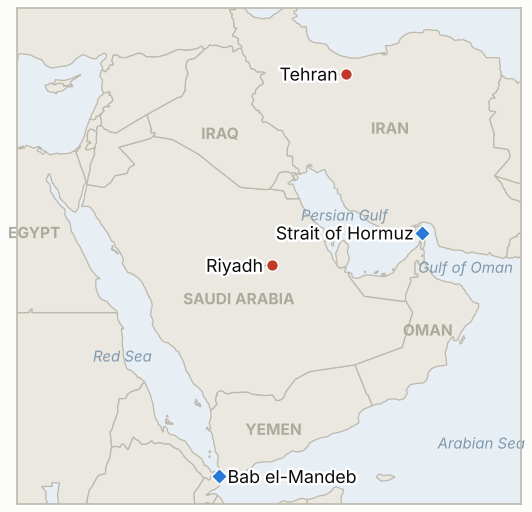

# Middle East Daily Briefing

**October 10, 2026**

- **Reporting window:** ~24 hours, October 9, 06:00 to October 10, 06:00 KST
- **Overall assessment:** Trump's pledge of no strikes on Iran before the November 3 midterms held through the window, but the NYT reported that the Pentagon has drafted a three day campaign against Iranian missile, drone, energy and IRGC targets that he has not approved, while Iranian President Pezeshkian said Tehran has revised its peace proposals (§1.1). The IRGC claimed it struck the LPG carrier NV Sunshine on what it calls an illegal route south of Hormuz, without independent confirmation (§1.2). Brent eased to about $103 and the White House moved on supply: Russia is to release 300,000 tonnes of diesel, Treasury waived some Russia energy sanctions and Germany will release up to 15 million barrels (§1.3). Major airlines suspended Riyadh flights after the Houthi airport attacks that killed three Saudis (§1.4). Korean markets were closed for Hangul Day, so there is no KOSPI or won print, and coverage of the window is thin: no Brent settle and no Hormuz transit count were found.

**Corrections and updates:** The October 9 brief (§1.4) left airport casualties unsettled; CBS now reports that Saudi authorities said three Saudi citizens were killed in the Riyadh airport attacks, which resolves that conflict toward the Saudi figure. The October 9 brief (§1.3) relied on a second hand Axios report of Pentagon preparations; the NYT now reports a drafted three day campaign that Trump has not approved. The October 9 brief put Brent's Thursday high at about $105 intraday; WTI settled at $91.49 that day (+3.6%), backfilled in the data.

---

## 1. What Happened

<figure style="float:right; width:46%; margin:2pt 0 8pt 14pt;">

<figcaption style="font-size:8pt; color:#666; text-align:center; margin-top:3pt; font-style:italic;">Major places of discussion</figcaption>
</figure>

### 1.1 Restraint pledge, a drafted strike plan and revised Iranian proposals

Trump posted that the United States "will not be attacking Iran at any time prior to the Midterm Elections" on November 3 and that the naval blockade stays in place ([CBS News](https://www.cbsnews.com/live-updates/iran-war-trump-us-elections-saudi-arabia-yemen-houthis/)). Search summaries of NYT reporting say the Pentagon has drawn up plans for a three day campaign against Iranian missile and drone arsenals, energy facilities and IRGC sites, which Trump has not approved; this briefing could not open the NYT piece. Pezeshkian said Iran has revised its proposals for peace talks and is ready to finalize them through mediators, and accused Washington of attacking each time talks begin; Trump had rejected Iran's "7 day plan" in late September ([CBS News](https://www.cbsnews.com/live-updates/iran-war-trump-us-elections-saudi-arabia-yemen-houthis/)). **Confidence: High that Trump and Pezeshkian made these statements; Low on the NYT plan (second hand); Low on the pledge being binding.**

### 1.2 IRGC claims a strike on the LPG carrier NV Sunshine

Iran's IRGC said its navy struck a "giant LPG gas carrier named NV Sunshine" trying to use "the illegal route" south of the Strait of Hormuz, causing a "massive fire in the engine room and propulsion system" ([Al Jazeera](https://www.aljazeera.com/news/liveblog/2026/10/9/iran-war-live-iranian-media-reports-massive-explosions-in-hormuz-strait)). The page gave no time and no independent confirmation, and our search found no UKMTO report of the strike; a vessel of that name was reported transiting Hormuz safely in May. A third party tracker says Iran and Oman have agreed coordinates for designated safe routes while Iran still declares the strait closed. The Al Jazeera headline also cites Iranian media reports of "massive explosions" in the strait, with no details retrieved. **Confidence: High that the IRGC made the claim; Low that the strike and damage occurred as described; Low on the route arrangement (single tracker).**

### 1.3 Russia diesel release and sanctions waiver as Brent eases to about $103

Trump said Russia agreed to supply over 300,000 tonnes of diesel to global markets "immediately," the Kremlin said Trump and Putin discussed Iran, and CBS reported that Treasury temporarily waived some sanctions on Russia's energy sector ([Al Jazeera](https://www.aljazeera.com/news/liveblog/2026/10/9/iran-war-live-iranian-media-reports-massive-explosions-in-hormuz-strait); [CBS News](https://www.cbsnews.com/live-updates/iran-war-trump-us-elections-saudi-arabia-yemen-houthis/)). Germany said it will release up to 15 million barrels of diesel, crude and heating oil. Brent eased from about $105 on Thursday to about $103 on Friday, and AAA put US diesel at $6.28 a gallon, below the $6.53 record of September 22. No Brent settle for Friday was found; the 300,000 tonnes is small against global diesel demand, and no delivery schedule was given. **Confidence: High on the statements; Medium on the Brent level (quote, not settle); Low on delivery timing.**

### 1.4 Airlines suspend Riyadh flights after three Saudis killed

Saudi authorities said three Saudi citizens were killed in the Houthi attacks on King Khalid International Airport, one on facilities and one on an empty Saudia aircraft; the Saudia captain Hamoud Ali Alkalthami was among the dead ([CBS News](https://www.cbsnews.com/live-updates/iran-war-trump-us-elections-saudi-arabia-yemen-houthis/)). On Friday Lufthansa, Emirates, Etihad and other carriers suspended Riyadh flights, EASA advised caution in parts of Saudi airspace, the UK, France, Germany, Australia and Canada issued advisories, and the US now requires government employees to get authorization to use the airport. Houthi spokesman Yahya Saree said humanitarian flights to Riyadh need Houthi permission, and Saudi backed Yemeni forces claim the Bab el-Mandeb coast, which the Houthis deny. **Confidence: High on casualties and suspensions (CBS); Low on control of Bab el-Mandeb (partisan claims); Low on Saree's statement as policy.**

---

## 2. Deep Dive: Incentives and Motives

### 2.1 Why would Washington pair a restraint pledge with a drafted three day strike plan?

The pledge buys political room before November 3: polls cited in earlier coverage show only a minority backs the war, and diesel at $6.28 is a voter issue. The plan, whether or not leaked deliberately, keeps coercive pressure on Tehran and prepares an option for the post election period. Pezeshkian's revised proposals suggest Iran reads the pledge as a window to bargain from, and that it hopes to lock in terms before options reopen.

### 2.2 Why is the White House turning to Russia for diesel and sanctions relief now?

Because diesel is the tightest part of the market and the one voters see at the pump, while strikes are ruled out until the election. Russian barrels and a German stock release are the available levers that do not involve Hormuz. The cost is political: waivers for Russia weaken sanctions leverage in the Ukraine track, which Trump appears willing to accept for a lower pump price before the vote.

### 2.3 Why does Iran keep striking ships on the "illegal route" instead of letting traffic recover?

An Iranian declared closure only means something if ships that ignore it pay a price. Hitting a vessel on the southern route, even with an unverifiable claim, signals that Oman coordinates or Western escorts do not override Iran's authority, and it keeps insurers and charterers cautious while talks are revised. The claims also cost little: no confirmation is needed for them to move risk premia.

### 2.4 Why are the Houthis aiming at Riyadh's airport rather than oil assets?

Aviation is a cheaper pressure point: three deaths and carrier suspensions isolate the capital and raise the political cost for Riyadh without the oil damage that would trigger a harsher response. Saree's claim that humanitarian flights need Houthi permission extends that logic into an assertion of authority over Saudi airspace.

---

## 3. Policy Implications for South Korea

**Exposure snapshot:** South Korea draws about 70.7% of its crude and 20.4% of its LNG from the Middle East (`instructions/korea-exposure.md`, no update needed). Korean markets were closed on October 9 for Hangul Day, so the last prints remain KOSPI 6,625.93 and 1,338.5 won per dollar from October 8; KOSPI is about 5.4% below its October 2 close of 7,003.74 over three sessions. Brent near $103 is a little above the $100.20 settle of October 7.

**Implications by development:**

- **US-Iran (§1.1):** the pledge narrows escalation risk to November 3 but a drafted plan means the tail risk returns after; revised Iranian proposals make a disclosed US response the next signal (IND-20261010-2).
- **Hormuz (§1.2):** unconfirmed IRGC claims still lift war risk premia on Korea bound Gulf cargoes; LPG carriers matter for Korean gas imports. No Korean government statement on the pending Hormuz deployment (IND-20260928-2) was found.
- **Supply (§1.3):** Russian diesel and a German release help diesel but are minor for Korea's crude-heavy exposure; Korea's stock cover of about 206 days gives time.
- **Gulf aviation (§1.4):** carrier suspensions to Riyadh affect Korean contractors and travelers; a Korean advisory update is worth watching (IND-20261010-3).
- **Markets:** Monday, October 12 is the first Korean session since the Samsung result, with foreigners net selling through October 8 (IND-20261009-3, IND-20261008-2).

**Testable indicators:**

- **IND-20261010-1** (open, new): KOSPI closes above 6,625.93 on Monday October 12 confirms a rebound; a close at or below it falsifies (deadline 2026-10-12).
- **IND-20261010-2** (open, new): a disclosed US substantive response, counterproposal or announced joint session on Iran's revised proposals by ~2026-10-20 confirms diplomacy moving; none falsifies.
- **IND-20261010-3** (open, new): Emirates or Lufthansa resumes Riyadh flights by ~2026-10-23 confirms de-escalation of the aviation threat; none falsifies.
- **IND-20260929-1** (resolved, confirmed): Pezeshkian disclosed revised Iranian proposals on October 8, within the ten day window.
- **IND-20261001-1** (resolved, confirmed): the same disclosed Iranian response arrived before the October 11 deadline.
- **IND-20261002-1** (resolved, falsified): no disclosed evidence or strike citing the flydubai incident by October 9.
- **IND-20260918-1** (resolved, expired): no verified Yemen displacement figure above 200,000 was found by October 9.
- **IND-20261008-1** (open): Brent traded about $103 Friday with no settle above $105 found; deadline ~2026-10-16.
- **IND-20261009-1** (open): no disclosed US strike in the window; deadline ~2026-10-23.
- **IND-20261006-1**, **IND-20261005-1**, **IND-20261004-1**, **IND-20261007-1**, **IND-20261007-2**, **IND-20261009-2**, **IND-20261009-3** and the remaining older open items (open): no resolving information in the window.

---

## 4. Watch List

- **Any US response to Iran's revised proposals and any Iranian reaction to the reported three day plan (IND-20261010-2, IND-20261009-1).**
- **Confirmation or denial of the NV Sunshine strike by UKMTO or the owner, and Hormuz tanker counts (IND-20261009-2).**
- **Delivery of Russian diesel and the scope of the Treasury waiver.**
- **Riyadh airport operations and airline resumptions (IND-20261010-3).**
- **KOSPI foreign flows on Monday, October 12 (IND-20261010-1, IND-20261009-3).**
- **Brent settle for the week and diesel at the US pump (IND-20261008-1).**

---

## 5. Source Quality Summary

| Claim | Sources | Confidence |
| --- | --- | --- |
| Trump: no attack on Iran before Nov 3; blockade stays | CBS News | High as a statement |
| Pentagon drafted a three day campaign, not approved | NYT via search summary; original not retrieved | Low |
| Pezeshkian: Iran revised proposals, ready to finalize | CBS News | High as a statement |
| IRGC struck LPG carrier NV Sunshine | Al Jazeera citing the IRGC | Low on the strike |
| Iran and Oman agreed safe route coordinates | iranwarlive.com tracker | Low |
| Russia to release 300,000 t diesel; Treasury waiver; Putin call | Al Jazeera, CBS News | Medium |
| Germany to release up to 15 million barrels | CBS News | Medium |
| Brent about $103 Friday; WTI $91.49 settle Oct 8 | CBS News, CNBC via search summary | Medium |
| Three Saudis killed at Riyadh airport; airline suspensions | CBS News | High |
| Bab el-Mandeb control | CBS News, partisan claims | Low |
| Korean markets closed Oct 9 | Hangul Day holiday (inferred from calendar) | High |
